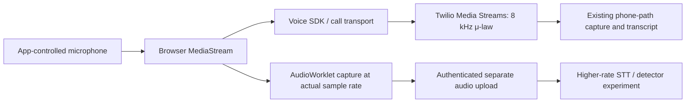

# Audio quality: what 8 kHz means for this project

**Keep the current phone pipeline at its real 8 kHz rate. For higher-quality source audio, add a separate capture path from an app-controlled microphone before it enters the telephone path.** Changing the sample-rate label cannot improve a recording.

Twilio **Media Streams** always exports mono μ-law at 8000 samples per second. Its `start.mediaFormat` contract fixes the encoding, rate, and channel count. That applies to the WebSocket stream this repository receives, including when the original caller uses a VoIP endpoint. It is not a statement that every Twilio product or every VoIP call is narrowband. [Twilio Media Streams format](https://www.twilio.com/docs/voice/media-streams/websocket-messages).

## Call reliability and response timing

The October 1 call repair addresses long waits after the caller finishes and
interruptions within generated speech:

- Caller endpoints use recognized word timing. Empty noise/VAD events no longer
  permanently veto a valid endpoint. A recovery timer requires finalized words,
  fresh incoming audio, at least 750 ms of quiet, and 1.5 seconds without word
  progress. Continuing speech, unresolved interim words, and a disconnected
  audio stream prevent that fallback.
- Bot output uses a 20 ms frame cadence, an initial reserve of up to 120 ms,
  and a producer queue target of 300 ms. Marks and clears do not consume audio
  time slots. An underrun is recorded rather than filled with an extra burst of
  synthetic silence. A socket stall resets the cadence rather than sending a
  catch-up burst.
- The native conference defaults to `NATIVE_CONFERENCE_JITTER_BUFFER=medium`
  for human and bot participants, including rejoins. `small`, `medium`, `large`,
  and `off` are accepted. A larger buffer trades latency for tolerance of late
  packets; choose another value only after examining actual call measurements.
  [Twilio conference jitter buffer](https://www.twilio.com/docs/voice/twiml/conference).
- The default agent's disclosure is synthesized while the human call connects.
  Bot provisioning and disclosure preparation also run concurrently during
  takeover. Short adjacent sentences are combined into one v3/v4 synthesis
  request, with a maximum 200 ms wait and 160-character target, to reduce
  repeated synthesis setup and prosody resets. Playback acknowledgments and
  caller interruption still bound prefetch and cancel unheard speech.

Authenticated browser calls now save SDK jitter, round-trip time, packet loss,
estimated MOS, warnings, negotiated codec, and coarse microphone processing
settings. Packet loss is reported as a percentage. These are browser-leg
observations, not measurements of every carrier leg. The diagnostic upload is
bounded and best effort; its failure cannot terminate a call. It excludes audio,
tokens, IP addresses, device labels, and unique browser device identifiers.

Owner-authenticated `GET /api/calls/{call_sid}/quality` returns the browser
observations and voice timing/buffer events under the remote call SID used by
history. When the existing `MEDIA_CAPTURE_ENABLED` setting is enabled, the voice
diagnostics also retain up to 180 seconds per track of generated source bytes
and bytes actually sent to Twilio. After the call, the owner can retrieve
`/api/calls/{call_sid}/quality/generated.wav` and `sent.wav`. These WAVs concatenate
their source bytes; they are **not a synchronized call recording**. Use the
diagnostic event offsets and truncation fields when comparing them with the
existing call recording. Generated chunks can interleave between the currently
playing phrase and a prefetched phrase; their phase identifiers identify each
source. Files are private and live under
`CALL_DETAILS_STORAGE_DIR/audio-quality` and `browser-quality`.

The next real call is needed to confirm carrier and browser quality. The repair
does not enable paid Twilio Voice Insights or change the fixed Media Streams
format. It preserves the browser's existing preference for Opus.

## Distinguish the call from its exported stream

| Layer | This project's current path | What a change can achieve |
| --- | --- | --- |
| Original microphone | Whatever the caller's phone provides | A better microphone/environment can reduce noise; we do not control that source. |
| Call transport | Twilio connects the incoming call to the configured teammate through a conference | Codec support depends on the endpoints and intervening route. |
| Media Streams export | Mono μ-law, 8 kHz, base64 inside Twilio WebSocket messages | This interface has no setting to request a 16/48 kHz export. |
| Saved partner WAV | Mono signed PCM16, 8 kHz, decoded from the stream | PCM makes it convenient to process; decoding does not add frequency detail. |
| Deepgram input | Raw stream audio with the correct encoding/rate parameters | Transcription works on supported telephone audio; it does not require pretending it is high fidelity. |

An 8 kHz sample rate represents at most frequencies below 4 kHz in an ideal sampled signal; the real telephone chain can preserve less. Sample rate is not bitrate: μ-law uses one byte per sample, while decoded PCM16 uses two. Both versions still have 8000 samples per second. A 20 ms mono segment is 160 μ-law bytes or 320 PCM16 bytes, before transport overhead.

Upsampling to 16 kHz produces more samples that describe the existing signal. It cannot recover acoustic information removed upstream. A 16 kHz WAV header on unchanged 8 kHz samples changes playback timing and pitch; that is not resampling. Partners must retain original format and conversion metadata when comparing detectors. [Detection input design](DEEPFAKE_DETECTION.md).

## Can VoIP be better?

**Yes, when the higher-quality audio stays on a path that supports it.** Twilio's Voice JavaScript SDK supports Opus and PCMU. A browser client can prefer Opus with `codecPreferences: ["opus", "pcmu"]`; Twilio documents its quality/bandwidth advantages. Actual negotiation and the rest of the route still matter. [Voice SDK codec options](https://www.twilio.com/docs/voice/sdks/javascript/twiliodevice).

A browser or app endpoint using Opus does **not** change the fixed Media Streams export. If a detector receives its bytes through the existing Twilio Media Streams connection, it still receives 8 kHz μ-law. A call touching a public phone network can also encounter narrowband conversion elsewhere. Do not advertise end-to-end wideband merely because one leg negotiated Opus.

| Option | What improves | What remains limited | Work involved |
| --- | --- | --- | --- |
| Keep the current Twilio phone number and Media Streams | Lowest implementation effort; real phone transcription and existing partner WAVs | Export remains 8 kHz | Current build path. |
| Add a Twilio Voice SDK browser endpoint with Opus preferred | The browser's transport can use a better codec | Media Streams export remains 8 kHz; other call legs can still limit quality | Browser calling, signed access tokens, device selection, call UI, route testing. |
| Capture the browser microphone separately before call encoding | A detector/STT service can receive genuinely higher-rate **local** microphone audio | Does not restore the remote phone caller's lost bandwidth | Permissioned capture, sample-rate-aware encoding, authenticated transport, session binding, separate retention. |
| Build an app-to-app WebRTC path with separate source tracks | Both app-controlled participants can supply higher-quality audio | Any PSTN fallback still has its own limitations | New media architecture and its own audio/security/quality tests. |

A SIP or SIPREC product is not automatically a wideband escape hatch. Before choosing one, verify that product's accepted codecs, negotiated media, fork/recording format, and every interconnection. This repository has not implemented or verified a higher-rate SIP recording path.

## A concrete future high-quality capture design

This is a proposed partner extension, **not code running in Build 3**:

1. Acquire microphone access through `getUserMedia()` over a secure origin. Request the desired settings, then inspect `MediaStreamTrack.getSettings()`; supported constraints and actual capture settings can differ. A requested 48 kHz rate is not proof that every microphone or browser delivers it. [Media Capture and Streams specification](https://www.w3.org/TR/mediacapture-streams/).
2. Use a Web Audio processing path to collect frames from that local stream. Record the actual `AudioContext.sampleRate`, channel policy, sample counters, and processing settings. Use `AudioWorklet` for ongoing audio processing; do not assume UI-thread callbacks meet real-time timing. [Web Audio specification](https://www.w3.org/TR/webaudio/).
3. Send a separately authenticated, bounded audio stream to a backend. Declare the real source format and bind it to an authorized call/session plus the local participant identity. Resample only when the receiving provider requires a different rate.
4. Keep its timeline and provenance distinct from the Twilio capture. Do not relabel high-rate **owner** audio as the remote caller's source. Measure synchronization and drift before comparing both paths.
5. Evaluate matched originals, phone-path captures, and app-path captures. Compare word error rate for transcription, calibrated/held-out detection results for synthetic-speech models, and observed latency. Higher bandwidth is useful evidence, not an automatic accuracy guarantee.

Browser echo cancellation, noise suppression, and gain processing can modify acoustic evidence. Record their settings, and evaluate both realistic call processing and controlled reference captures where supported. Do not turn a low-noise lab recording into a claim about arbitrary phone calls.

## Deepgram accepts the current telephone format

For raw Twilio payload bytes, the live endpoint is `wss://api.deepgram.com/v1/listen` with `encoding=mulaw&sample_rate=8000&channels=1`. Decode only the base64 transport before sending the binary μ-law bytes. Deepgram's Twilio guide documents this route. [Twilio + Deepgram STT](https://developers.deepgram.com/docs/twilio-and-deepgram-stt).

For already-decoded `AudioFrame.pcm_s16le`, use `encoding=linear16&sample_rate=8000&channels=1` and send those PCM bytes. For a complete WAV/container upload, let the provider inspect the container according to its endpoint contract; do not declare raw encoding parameters for a container by accident. [Deepgram encoding](https://developers.deepgram.com/docs/encoding), [sample-rate settings](https://developers.deepgram.com/docs/sample-rate).

Changing Deepgram's `sample_rate` to 16000 while still sending the 8 kHz bytes corrupts its interpretation of the audio. Real resampling is necessary when an API specifically requires 16 kHz; it is unnecessary for this supported 8 kHz transcription route.

## Preserve the two current track meanings

| Track | What it contains | Safe label in partner work |
| --- | --- | --- |
| `inbound` | Original caller's incoming microphone audio, including any background sound or speakerphone leakage | Caller input |
| `outbound` | What Twilio plays to that caller: teammate conference audio, hold music, and other playback | Caller playback |

The outbound track is not an isolated teammate microphone. Transcribing both directions helps inspect the conversation, but neither label establishes a speaker's identity. Detecting synthetic audio on playback would also detect our own future cloned voice. Use the inbound track for the current incoming-caller detector design. [Capture contract](PARTNER_HANDOFF.md).

**Implementation choice:** Build 3 uses the existing telephone stream for live transcription. Higher-rate app capture remains a separate future experiment so partners can compare it with the real phone path without changing the evidence's provenance.
