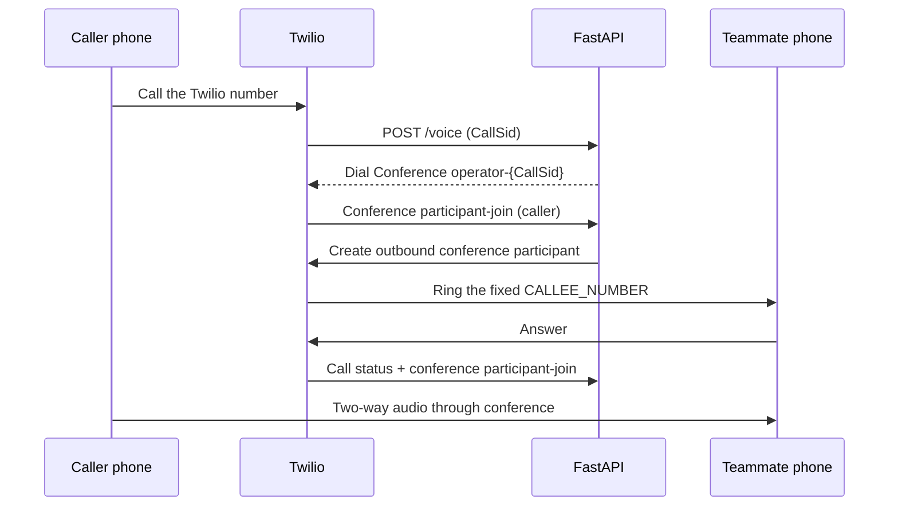

**Next: call the Twilio number from a different phone, answer the configured teammate phone, and speak in both directions for 30 seconds.**

# Build 1 — two humans talking

**Status: implemented and phone-tested on 2026-09-26.** The bridge, callback authentication, duplicate prevention, timeout cleanup, and call-aware deployment are covered by automated tests. Allow about 5 minutes for the phone checks below with two phones available. The forwarding destination is private configuration and is never accepted from caller-supplied form data.

Set `CALLEE_NUMBER` in the active server `.env` to enable forwarding. `/health` reports `build: 1` and `switchboard_ready: true` when configured. Empty `CALLEE_NUMBER` retains the Build 0 greeting. Calls originating from the forwarding number or the Twilio number are rejected to avoid loops.

Success is one incoming call to the Twilio number, one outbound call to a fixed teammate, and intelligible two-way conversation. There is no AI, detector, transcription, recording, media WebSocket, or Redis in this milestone.

## Call flow

The caller joins first and waits. Only the signed caller-join callback may initiate the outbound participant, after the actual `ConferenceSid` is known. This avoids dialing a teammate before the caller reaches the room. Conference creation and participant management are supported by [Twilio’s Conferences API](https://www.twilio.com/docs/voice/api/conference-resource).

## Implemented flow

1. **Configuration and state.** Validate the fields below and keep a single-process session store keyed by inbound `CallSid`.
2. **Inbound conference.** Return the team greeting followed by conference instructions, signed event callbacks, and a dial-completion action.
3. **Outbound participant.** Reserve one outgoing attempt at caller join; duplicate callbacks cannot redial.
4. **Lifecycle and failures.** Track joins, leaves, ringing, terminal call results, abandoned callers, and timeouts. Cancel orphaned calls and end the room when appropriate.
5. **Verification.** Run automated checks, restart the local runner, and complete the two-phone acceptance checks below.

## Files and interfaces

These files implement the switchboard. The external callback contract remains the one specified below.

| File | Responsibility |
| --- | --- |
| `app.py` / `config.py` | Signed routes, conference TwiML, deployment control, validated settings, and health. `main.py` remains the entrypoint. |
| `switchboard/models.py` | `CallSession`: inbound SID, conference name/SID, outbound SID, phase, timestamps, joined/started facts, event identities and dial reservation. |
| `switchboard/service.py` | In-memory session dictionary, lock-protected transitions, Twilio client calls, timeout/cleanup tasks. |
| `switchboard/gateway.py` / `webhooks.py` | Async facade over bounded Twilio REST calls, and shared exact-URL signature/account validation. |
| `tests/test_switchboard.py` / `tests/test_switchboard_engine.py` | Mocked Twilio API, signed webhook requests, duplicate/racing events, failure and cleanup behavior. |

Run one Uvicorn worker without reload during calls. State uses a dictionary plus `asyncio.Lock`, with up to 16 active sessions and 4,096 total records; completed records remain for 24 hours. Automatic deployment drains active sessions and pending REST work before replacing the app. An explicit stop ends calls, and state disappears on a crash. Shared persistence remains a later milestone.

| Setting | Build 1 use |
| --- | --- |
| `TWILIO_ACCOUNT_SID` / `TWILIO_AUTH_TOKEN` | Account identity and mandatory verification of every Twilio webhook. |
| `TWILIO_API_KEY` / `TWILIO_API_SECRET` | Optional REST credentials, supplied together; otherwise use account SID/Auth Token. Match the names already used in local configuration. |
| `TWILIO_NUMBER` | The owned, voice-capable Twilio number used as outbound `from`, in E.164 format. |
| `CALLEE_NUMBER` | One explicitly allowlisted teammate number, in E.164 format; reject the Twilio number itself. |
| `PUBLIC_BASE_URL` | Current ngrok HTTPS origin for TwiML and callbacks; already managed by the development runner. |

Do not accept `to`, a dial destination, or an arbitrary callback URL from inbound form data. Keep credentials and phone numbers out of committed fixtures and ordinary logs. REST API key authentication does not replace the account Auth Token used for signature verification. Use the official validator with every received form parameter and the exact public URL, including query parameters. [Twilio security](https://www.twilio.com/docs/usage/security) and [API authentication](https://www.twilio.com/docs/usage/requests-to-twilio).

On a Twilio trial account, verify the teammate's destination under **Verified Caller IDs** before testing outbound calls. Check that the destination country is enabled in Voice geographic permissions.

## Route contract

| Route | Required behavior |
| --- | --- |
| `POST /voice` | Validate signature and account; create/reuse session for inbound `CallSid`; return caller conference TwiML. |
| `POST /conference/events/{parent_call_sid}` | Validate signature; bind/verify conference identity; process `join`, `leave`, `start`, `end`; initiate exactly one outbound attempt on the caller’s first join. |
| `POST /calls/status/{parent_call_sid}` | Validate signature; verify the outbound SID; track initiated/ringing/answered/completed events and terminal `CallStatus`. |
| `POST /conference/finished/{parent_call_sid}` | Validate signature; finish the caller leg with a short result or hangup after `<Dial>` returns; repeat safely. |
| `GET /health` | Preserve the existing service health endpoint; exclude secrets and call data. |

`webhooks.py` validates signature and account without assuming every event has `CallSid`. Routes separately validate their required SID fields: conference-wide start/end events do not require `CallSid`. The original `/status` remains available. Unknown sessions and semantically unrelated conference events are acknowledged without changing state; malformed required SIDs return 400.

Return TwiML only where Twilio expects call instructions. Event receivers acknowledge accepted callbacks promptly with a successful HTTP response; they do not drive call audio through their response body. Run blocking Twilio SDK calls outside the async event loop and use bounded API timeouts.

## Conference choices

Use `operator-{inbound CallSid}` as the conference name and stable labels `caller` and `callee`. The caller has `startConferenceOnEnter=false`; the callee has `startConferenceOnEnter=true`. Set `endConferenceOnExit=true` for both in Build 1, `beep=false`, and `maxParticipants=2`. Configure callback URL/events on the caller, who joins first. Twilio uses the first participant’s conference callback configuration. Labels must be unique within the room; leaving with `endConferenceOnExit=true` ends it for everyone. [Twilio Conference reference](https://www.twilio.com/docs/voice/twiml/conference).

After the caller’s join event, create the outbound participant using `client.conferences(conference_sid).participants.create(...)`: `from_=TWILIO_NUMBER`, `to=CALLEE_NUMBER`, `label="callee"`, matching start/end flags, a 25-second ringing timeout, and the call-status URL. Subscribe to `initiated`, `ringing`, `answered`, and `completed`. Participant creation initiates the outbound call; no separate callee TwiML route is needed for this design. Twilio adds a small timeout buffer, so the configured timeout is not an exact stopwatch deadline. [Conference Participants API](https://www.twilio.com/docs/voice/api/conference-participant-resource).

An `answered` event alone is not proof that both people can talk. Mark the session connected only when both labeled participants have joined and the conference has started. A voicemail system can answer; the live test must establish that the teammate actually answered. Call-progress event subscriptions differ from the `CallStatus` values carried in those events. Handle `busy`, `no-answer`, `failed`, `canceled`, and `completed` as terminal outcomes. [Twilio Call resource](https://www.twilio.com/docs/voice/api/call-resource).

## Duplicate events and cleanup

1. **Reserve the dial attempt under a lock.** Change `waiting` to `dialing` before the API request, then release the lock for network I/O. A duplicate `/voice` or join callback must never trigger another outbound request. Store callback event identity/sequence so late events cannot reopen a terminal session.
2. **Handle uncertain API outcomes conservatively.** If participant creation times out, reconcile using the known conference and `callee` label to find and end a possibly created leg. Do not blindly repeat an outbound call whose success is unknown. For Build 1, a failed attempt ends the session; a fresh inbound call is the manual retry.
3. **Handle the caller leaving during dialing.** Mark the session ending and cancel any queued/ringing outbound call. Recheck session state after participant creation returns; if the caller already left, cancel that newly returned call too.
4. **Bound the waiting period.** On busy, no-answer, failure, or a local deadline (45 seconds from the initial inbound webhook), stop the outbound leg and redirect the caller to a short unavailable message followed by hangup, or end the conference. The implemented Build 1 ends the room and both legs; it does not promise a spoken busy/no-answer message. Cleanup is idempotent and retries transient termination failures once.
5. **Retain terminal session tombstones briefly.** Keep completed sessions for 24 hours before removing them, with a bounded store size. This prevents a delayed webhook from recreating a completed call. Log IDs/state transitions, not raw callback bodies.

## Acceptance checks

Automated checks use mock phone numbers and a mocked Twilio client; they do not place paid calls.

1. **Happy path:** one signed inbound request and caller join create one conference session and one outbound participant with the configured destination. A different inbound SID gets a different room.
2. **Request security:** unsigned/invalid signatures and wrong account callbacks fail before a state change or REST request. Public HTTPS signature reconstruction still works through ngrok.
3. **Lifecycle:** duplicate, delayed, and racing callbacks never duplicate dialing or reopen terminal state. Busy/no-answer/API failure/timeout release the caller. Caller hangup during creation cancels the eventual outbound leg.
4. **Real phones:** caller dials the Twilio number; teammate answers; both speak and hear distinct phrases for 30 seconds. Use a caller phone different from `CALLEE_NUMBER`. Repeat once with each person hanging up first and verify the other leg ends.
5. **Real no-answer:** teammate does not answer; the caller receives the configured failure outcome within the deadline. Verify the Twilio logs show no orphaned outbound leg or active conference.

**Recorded result (2026-09-26):** the owner confirmed two-way audio, caller-first hangup, teammate-first hangup, and no-answer cleanup within the deadline. Twilio independently reported both legs of the first call completed at the same time, with the caller ending the conference. The automated suite passes 137 tests. Private call IDs and observations are saved locally in `.runtime/build1-acceptance.json`; phone numbers and call records are not committed. Repeat the phone checks after a material telephony change.

## Later milestones

The final product adds outbound calls and owner keypad shortcuts that delegate the conversation to an agent using the owner's cloned voice. See [Final build — put your AI on the call](FINAL_BUILD.md) for `#1`–`#4` prompt selection, context transfer, and return-to-human behavior. Build 1 remains the two-human switchboard; manual delegation will work independently of AI detection.

| Build | Deliverable |
| --- | --- |
| 2 | Capture clearly identified call audio with Media Streams; decode the incoming audio format correctly and write playable WAV files. |
| 3 | A manual takeover button with a proven agent-audio bridge, readiness handshake, and cleanup behavior. |
| 4 | A real conversational agent using the proven bridge. |
| 5 | A detector that can trigger the already-tested takeover flow automatically. |
| 6 | Transcript, conversation context, Pangram integration, and intent handling after the core call path is reliable. |

For Build 2, `<Start><Stream>` observes audio and continues to the next TwiML verb; it cannot send agent audio back. `<Connect><Stream>` supports bidirectional audio but blocks subsequent TwiML until it ends. Merely placing it before `<Dial><Conference>` does not add an AI participant. [Twilio Stream reference](https://www.twilio.com/docs/voice/twiml/stream).

The selected final-build route is the [two-stream Python audio bridge](IMPLEMENTATION.md), replacing the conference audio path. The conference route below is a documented alternative, not a second required implementation. Before using it for Build 3, explicitly design the agent leg. One documented option adds an `app:<APP_SID>` conference participant whose TwiML application returns `<Connect><Stream>`. Prove that bridge with simple audio first, make the agent ready before removing a human, and revise `maxParticipants` and `endConferenceOnExit` so removing the callee does not terminate the caller or agent. [Twilio’s conference/Media Streams bridge guide](https://help.twilio.com/articles/45314613523867).

The milestone sequence follows [the shared Grok conversation](https://grok.com/share/bGVnYWN5_618ab7b3-9c27-4570-9709-edd7bee0bc21); the route layout, lifecycle rules, and verification plan above are implementation recommendations for this repository.
