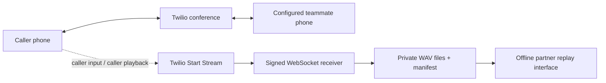

# Build 2 — Twilio audio capture

**Make a short two-phone call, hang up, then play its finalized recording in the dashboard.**

Build 2 adds a passive Media Stream to the working Build 1 conference. The phone bridge still connects the incoming caller to the fixed `CALLEE_NUMBER`. The server saves two playable WAV files and a manifest for partner development. Allow about two minutes for the phone check after configuration. Automated checks and a real local WebSocket transport check pass; real Twilio capture verification must be recorded separately below.

**Build 2 milestone scope: Twilio capture.** This guide documents the recording layer. [Build 3](BUILD_3.md) now adds optional live Deepgram transcription and a public viewer. Detection, voice cloning, agent speech, and takeover remain unimplemented; partners also get typed audio contracts and an offline replay runner in [PARTNER_HANDOFF.md](PARTNER_HANDOFF.md).

## Call and capture path



The inbound TwiML plays the team greeting and a recording notice, starts `<Start><Stream track="both_tracks">`, then enters `<Dial><Conference>`. `Start` continues to the next TwiML verb, so Python does not carry the human conversation. An unavailable recorder does not disconnect the two people. [Twilio Stream reference](https://www.twilio.com/docs/voice/twiml/stream).

| File | Content |
| --- | --- |
| `inbound.wav` | Audio received from the original caller's microphone. |
| `outbound.wav` | Audio played to that caller: the teammate's conference audio, hold music, and other playback on the caller leg. |
| `manifest.json` | Stream/call IDs, format, track meaning, sample counts, timestamps, padding, dropped/rejected messages, and completion reason. |

The outbound file is a **caller-playback track**, not an isolated teammate microphone. Both WAVs contain mono PCM16 at 8 kHz. Their timeline starts at Twilio media timestamp zero; missing intervals are padded with silence. The manifest reports padding so a consumer does not mistake all silence for observed silence. Twilio's incoming format is raw μ-law; the recorder decodes it locally. [WebSocket audio messages](https://www.twilio.com/docs/voice/media-streams/websocket-messages).

## Enable capture

Set these values in the environment used by the running server:

```dotenv
MEDIA_CAPTURE_ENABLED=true
MEDIA_STORAGE_DIR=/absolute/private/path/to/recordings
MEDIA_MAX_SECONDS=1800
```

`MEDIA_STORAGE_DIR` must be absolute and should be outside per-release checkouts. On the server Mac it is configured privately as `~/Library/Application Support/NewCollegeOperator/.runtime/recordings` with the home directory expanded. The active configuration file is `~/Library/Application Support/NewCollegeOperator/.env`; the development checkout has its own `.env`.

1. Keep the existing Twilio credentials, `TWILIO_NUMBER`, and `CALLEE_NUMBER` configured. Capture is only added when the conference bridge is configured.
2. Set the three capture values above. `MEDIA_MAX_SECONDS` accepts integers from 1 to 3600; its default is 1800. Reaching the limit stops capture while the human call continues.
3. Apply configuration during an idle period using the [server controls](SERVER.md). Infrastructure changes to the supervisor require `python3 scripts/server.py install`; ordinary app changes deploy from GitHub.
4. Check `/health` for the current build (`build: 3` after the transcription upgrade), `switchboard_ready: true`, and `media_capture_enabled: true`. These report configuration, not proof of a recorded phone call.
5. Call from a phone other than `CALLEE_NUMBER`, answer the teammate phone, and exchange distinct phrases. The caller hears the recording notice before capture starts. Tell the teammate that this is a recorded test.

To retain the basic conference without new audio files, set both `TRANSCRIPTION_ENABLED=false` and `MEDIA_CAPTURE_ENABLED=false` before restarting. Build 3 requires capture when transcription is enabled, so disabling only capture is invalid. Capture-only and basic-conference modes require no AI-provider credentials.

## Inspect and replay a completed call

The recorder creates `MEDIA_STORAGE_DIR/<CallSid>/` only after a valid signed upgrade and a matching stream start. WAV files are private (0600); directories are private (0700). The manifest is atomically published after the WAVs close.

Open the server's capture folder on this Mac:

```sh
open "$HOME/Library/Application Support/NewCollegeOperator/.runtime/recordings"
```

From the repository, inspect one completed call without playing or printing its audio:

```sh
.venv/bin/python scripts/replay_capture.py \
  "$HOME/Library/Application Support/NewCollegeOperator/.runtime/recordings/<CallSid>/manifest.json"
```

Replace `<CallSid>` with the actual directory name. Add `--frames --realtime` to emit timed frame metadata to the example consumer. The replay tool performs no network requests and does not invoke a model. It accepts only completed captures and validates both WAV files before delivering frames. Its typed interface and a complete local consumer example are in [the partner handoff](PARTNER_HANDOFF.md).

Saved WAV captures remain under `MEDIA_STORAGE_DIR` and are excluded from Git. The current dashboard publicly serves finalized `completed` and `partial` local recordings for playback/download; anyone with the ngrok URL can access available audio. Files retain private local filesystem permissions, but their HTTP audio is public. Unfinished captures are not served, and Twilio cloud voicemail recordings are not proxied. Enabled Build 3 transcription separately sends live audio to Deepgram; it does not upload old WAV files. New deployments reuse the stable capture directory. There is no automatic deletion policy in this milestone.

## Play a saved capture

Open `.venv/bin/python scripts/open_dashboard.py`, select an available call, and press play. The default combined stereo WAV puts caller input on the left and caller playback on the right. Select a mono direction or download the selected WAV when needed. The combined response is generated from the original files, with silence padding when one is shorter; it creates no third disk file.

`GET /api/recordings` scans at most the first 1,000 directory entries and lists the newest ten valid captures found there; it does not guarantee newest-first discovery across a larger archive. `GET` or `HEAD /api/recordings/<CallSid>/audio?track=combined|inbound|outbound` serves the selected view and supports byte-range requests for browser seeking. The full contract is in [Build 3 playback](BUILD_3.md#play-or-download-a-finalized-recording).

Playback becomes available only after the WAV headers are final and the capture manifest has been published. A finalized `partial` capture can be inspected in the player, with that status shown; offline partner replay remains stricter and accepts only `completed` captures. Live/in-progress audio is not served. The browser uses the existing PCM16/8 kHz WAV format, so MP3/M4A conversion is not part of this implementation.

## Interfaces and failure behavior

| Component | Contract |
| --- | --- |
| `POST /voice` | Existing signed call setup; adds the notice and passive stream only when enabled. Each live call gets one idempotent capture reservation. |
| `WS /media/{CallSid}/` | Validate Twilio's signature against the configured external WSS URL, then bind account, call, stream, format, and one-use token before writing files. Query parameters are rejected. |
| `POST /media/status/{CallSid}` | Signed stream lifecycle callback; verify call SID, stream SID, stream name, and event. Store fixed error categories, not raw provider error text. |
| `media_capture/` | Bounded receiver and background WAV writer, pure Python μ-law decoder, timing and gap handling, atomic manifest, and cleanup. |
| `integrations/`, `scripts/replay_capture.py` | Typed PCM contracts and offline replay scaffolding. This synchronous replay API is not a live callback; Build 3 uses a separate built-in Deepgram observer. |

The WebSocket validator uses the exact configured `wss://…/media/<CallSid>/` path, including its trailing slash. It never trusts a forwarded host. Twilio documents full-URL signature validation and trailing-slash sensitivity for Voice WebSocket handshakes. The phone test confirms the live handshake; a synthetic signature test alone does not. [Twilio request security](https://www.twilio.com/docs/usage/security).

The receiver limits each message to 64 KiB and each decoded media payload to one second of audio. A 256-frame queue separates network reception from disk work. Timestamp and duration limits bound total output; larger valid silence gaps are written in small blocks. At least 64 MiB of free space is reserved before and during writing. Capture stops if storage, duration, or queue limits are reached; it never hangs up the conference.

A valid stream stop or call end with no rejected/dropped messages produces `status: completed`. Disconnects, truncation, or other capture problems produce `partial` or `failed` when a manifest can be written. If storage cannot create the capture directory, there may be no files; the application log records a fixed failure reason. The phone connection can still work in that case.

On call end, the capture gets a brief trailing-frame grace period and bounded finalization time. Deployment waits for both telephone sessions and pending capture work. Closing the stream does not call the Twilio call-termination API. Recordings survive app releases because their storage is outside release directories.

## Acceptance checks

1. **Transport and identity:** missing/invalid signatures, unknown calls, wrong tokens, replayed starts, wrong accounts, and malformed audio are rejected without creating an unrelated recording.
2. **Audio files:** a known μ-law fixture decodes correctly; both tracks have valid PCM16/8 kHz headers and correctly padded timestamps. No secret token appears in the manifest.
3. **Failure isolation:** storage and stream errors leave the conference alive. Queue, duration, and disk limits finish the recorder safely; hangup finalizes files and clears deployment work counts.
4. **Real phone:** two people talk normally, then hang up. Both files are nonempty and playable, each contains the expected direction, and the manifest is completed. Verify the real signed WebSocket was accepted.
5. **Partner replay:** load that completed manifest through the CLI and a simple typed consumer without Twilio or AI API calls. The replay tool must reject partial captures and invalid WAV paths/formats.

**Live capture evidence (2026-09-26):** the running service has one completed capture with valid mono PCM16/8 kHz WAV headers: inbound 27.73 seconds, outbound 27.67 seconds. This verifies files and headers only; no listening/content check was performed. Full phone capture acceptance remains pending. Build 1's two-human call and cleanup tests already passed.
