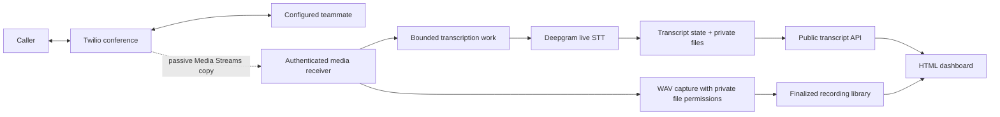

# Build 3 — transcripts and recorded-audio dashboard

```sh
.venv/bin/python scripts/open_dashboard.py
```

Run this from the source checkout on the server Mac. It reads the installed service's configured public URL and opens `/dashboard`. No viewer token or sign-in is required; anyone with the ngrok URL can read/download transcript text and play/download finalized local WAV recordings. The dashboard shows live Deepgram text and a recorded-audio player. A phone test still needs to establish actual call transcription; a healthy page alone cannot prove it.

Build 3 adds speech-to-text to the existing two-human Twilio conference and passive audio capture. It sends enabled call audio to Deepgram Nova-3, presents interim/final text in HTML, and preserves transcript data for partner development. The caller's conversation remains connected through Twilio; Python observes a copy of the media.

**Acceptance status:** all 395 automated tests pass, including recorded-audio playback, byte ranges, stereo alignment, and public-route checks. Chrome passed native playback, continued playback during polling, seeking to the end, and switching to an individual track using an isolated silent WAV fixture; no console warnings/errors were observed. This confirms player behavior, not recorded speech quality.

A browser check verified anonymous voicemail-inbox access using an isolated fake receipt; that check placed no phone call and invoked no speech/agent provider. Earlier generated speech passed the real Deepgram API and a full local Uvicorn signed-media/browser/export test, with both WAV tracks completed. The live service has one completed capture with valid mono PCM16/8 kHz headers: inbound 27.73 seconds and outbound 27.67 seconds. Only file metadata/headers were checked; audio content was not assessed.

**Full real-phone capture, transcription, and voicemail acceptance remain pending.** See [VOICEMAIL.md](VOICEMAIL.md) for the signed callback and message tests. Check the deployed revision with `python3 scripts/server.py status` and `/health`; test success alone does not establish deployment.

## What this build supplies

| Interface | Purpose |
| --- | --- |
| Existing Twilio number | Connect the incoming caller to the configured teammate phone. |
| `/dashboard` | Public HTML view for live/saved transcripts and finalized recorded audio. |
| Public `/api/transcripts` routes | List sessions, read a selected call, and export JSON or text. |
| Private transcript storage | Structured JSON outside release checkouts; readable text is exported through the public viewer. |
| Capture, playback, and replay | Finalized PCM16 WAV playback/downloads; typed offline audio frames for partners. |

This build transcribes speech; it does not classify deepfakes, run Gemini dialogue, synthesize an ElevenLabs voice, or implement keypad takeover. Those partner designs remain in [DEEPFAKE_DETECTION.md](DEEPFAKE_DETECTION.md), [VOICE_STACK.md](VOICE_STACK.md), and [IMPLEMENTATION.md](IMPLEMENTATION.md).

Optional [unanswered-call voicemail](VOICEMAIL.md) uses the same caller leg. Its ongoing capture/transcription path needs a real-phone continuity check; it never starts an AI conversation.

## Follow the media path



Twilio Media Streams exports mono μ-law at 8 kHz. The transcript path must declare the true codec and sample rate, while the existing recorder writes decoded PCM16 WAVs. Deepgram supports the raw μ-law telephone route through `wss://api.deepgram.com/v1/listen` with `encoding=mulaw`, `sample_rate=8000`, and `channels=1`. [Twilio format](https://www.twilio.com/docs/voice/media-streams/websocket-messages), [Deepgram's Twilio integration](https://developers.deepgram.com/docs/twilio-and-deepgram-stt).

| Direction label | Meaning | Limitation |
| --- | --- | --- |
| Caller input / `inbound` | The original caller's incoming audio | Includes background voices and possible speakerphone leakage. |
| Caller playback / `outbound` | Audio Twilio plays to that caller | Includes teammate conference audio, hold music, and prompts; not an isolated teammate microphone. |

The implementation opens a separate Deepgram WebSocket for each direction, each configured as mono. Two directions therefore create two provider streams. Preserve direction labels with every segment; do not merge the two raw tracks into a single mono stream or rename playback as a verified person. See [AUDIO_QUALITY.md](AUDIO_QUALITY.md) for what VoIP can improve and why it does not change this stream's 8 kHz export.

## Configure the installed server

Add these settings to the environment actually used by the server:

```dotenv
MEDIA_CAPTURE_ENABLED=true
TRANSCRIPTION_ENABLED=true
DEEPGRAM_API_KEY=replace_in_private_environment_only
DEEPGRAM_MODEL=nova-3
TRANSCRIPT_STORAGE_DIR=/absolute/private/path/to/transcripts
```

`TRANSCRIPTION_ENABLED` defaults to false. Keep the existing absolute `MEDIA_STORAGE_DIR` and capture configuration. The dashboard and transcript API are deliberately public: anyone with the ngrok URL can read/download available text and play/download finalized local recordings. Provider credentials stay on the server. Twilio signatures and deployment-control authentication remain required for their existing routes.

1. Put the settings in `~/Library/Application Support/NewCollegeOperator/.env` for the installed service. The source checkout's `.env` is separate; changing it does not configure the installed app.
2. Set an absolute transcript directory outside per-release checkouts, for example the installed service's `.runtime/transcripts` with the home directory fully expanded. Keep the directory private and excluded from Git.
3. Apply environment changes during an idle period using the [server controls](SERVER.md). A GitHub push changes app code; it does not install new private credentials. Explicitly restarting a busy service can interrupt active work.
4. Check `python3 scripts/server.py status` and `/health` to confirm the intended revision is active. Configuration readiness does not prove that Deepgram accepted a real audio stream.
5. Run `.venv/bin/python scripts/open_dashboard.py`, or open `PUBLIC_BASE_URL/dashboard` directly. Select a call when one appears. The plain dashboard URL can be shared without a login handoff.

Enabling transcription sends new enabled-call audio to Deepgram and can incur provider usage. It does not retroactively upload the existing recording archive. Set `TRANSCRIPTION_ENABLED=false` to stop new provider transcription while retaining the established Twilio/capture workflow.

## Read and reuse the output

Interim transcript text can change as more speech arrives. Use it for the live view; use finalized segments for saved exports and downstream partner processing. A finalized transcription is still a model prediction and can contain recognition errors.

Deepgram distinguishes finalized processed ranges (`is_final`) from endpointing boundaries (`speech_final`). Neither event makes a speaker's identity certain. The implementation retains track and media-time metadata and avoids duplicating finalized text when interim messages are revised. [Deepgram live response contract](https://developers.deepgram.com/reference/speech-to-text/listen-streaming).

### Public viewer API

| Route | Contract |
| --- | --- |
| `GET /dashboard` | Serve the public HTML viewer; it fetches transcript data from the public API. |
| `GET /api/transcripts` | Session metadata plus text for an automatically selected active/recent call. |
| `GET /api/transcripts?call_sid=<CallSid>` | Include finalized segments and interim text for the selected session. |
| `GET /api/transcripts/<CallSid>/export?format=json` | Export the selected call; use `format=txt` for readable text. |

The page polls selected-call data once per second; provider processing and network delay add to that refresh interval. There is no viewer login/logout flow or viewer session cookie.

On a free ngrok tunnel, click **Visit Site** if its initial notice appears. Snapshot requests send `Accept: application/json` and `ngrok-skip-browser-warning: 1`, with same-origin cookies, so ngrok does not substitute an HTML notice for the JSON response. Native audio and download links use the browser's normal same-origin requests and ngrok's notice-acceptance cookie. This does not add application authentication.

The API and downloads require no authorization header. They provide read-only access to recognized words, metadata, and finalized local WAV recordings; they do not place calls, redirect a call, change configuration, or deploy code. The same public origin serves Twilio and deployment endpoints, but those endpoints keep their existing signature/token checks.

JSON exports contain `schema_version`, `provider`, `model`, `sample_rate: 8000`, `track_meanings`, and the selected `session`. A selected-call JSON export may also include its voicemail metadata when present. Text exports are generated from finalized segments. Anyone with the public URL can list available call SIDs and download their transcript exports.

### Play or download a finalized recording

Select a call in the dashboard and use its audio player. **Combined** is the default: left channel is caller input, right channel is caller playback. Choose **Caller input** or **Caller playback** for one mono track. The download saves a WAV for the selected view.

Use an external Chrome window for the verified playback path. The in-app browser preview crashed when starting the fixture player; the Brave player path is unverified. WAV download remains available if an embedded player fails.

| Route | Contract |
| --- | --- |
| `GET /api/recordings` | Return `{enabled, storage_error, recordings}` with up to ten recent available captures. |
| `GET /api/recordings/<CallSid>/audio?track=combined` | Play/download a generated stereo WAV with aligned tracks; the shorter side is padded with silence. |
| Same audio route with `track=inbound` or `track=outbound` | Serve the selected original mono PCM16/8 kHz WAV. |
| `HEAD` on the audio route | Return audio response metadata without the body. |
| Audio request with `Range` | Serve a byte range for browser seeking without downloading the entire recording first. |

The catalog scans at most the first 1,000 directory entries and shows the newest ten valid captures among those entries. It does not guarantee the newest captures across a larger archive; the history limit does not delete files. Capturing can be disabled while existing finalized recordings remain publicly playable if `MEDIA_STORAGE_DIR` stays configured.

The transcript snapshot also includes this library under top-level `recordings`, so audio remains available when a call has no transcript. Library `storage_error` is independent of Deepgram and voicemail-cloud recording status. Metadata contains call/format/status information rather than local file paths or provider credentials.

Only captures with a published `completed` or `partial` manifest and finalized, validated WAV files are exposed. A partial recording is playable with its incomplete status visible; an active file or unpublished/failed capture is unavailable. This is recorded playback, not a live audio feed. The server restricts access to known call directories and fixed track names under `MEDIA_STORAGE_DIR`; the API is not an arbitrary file server.

Both source files are mono 8 kHz signed PCM16 WAVs. The combined response interleaves caller input on the left and caller playback on the right at the same sample rate. It pads a shorter track to the longer duration and is generated on request without saving a third WAV. No MP3/M4A transcoding is required for this player; those compressed exports remain optional future work. Combining the channels does not improve the original telephone bandwidth or turn caller playback into an isolated teammate microphone.

Twilio's separate voicemail cloud recording URLs are still not exposed or proxied. If only the cloud `Record` succeeded and no local capture finalized, the inbox can show voicemail metadata without playable audio.

### Stored and live data contract

The transcript API snapshot contains `schema_version`, `selected_call_sid`, `enabled`, `provider`, `model`, `revision`, `storage_error`, and `sessions`. The recording extension adds a top-level `recordings` library snapshot described above. The voicemail extension adds a top-level `voicemail` snapshot; `GET /api/voicemails` serves that same metadata directly, including when Deepgram is disabled. [Voicemail metadata contract](VOICEMAIL.md#public-metadata-api). Unselected sessions contain metadata with cleared segments/interim text; the selected call includes its text. When `call_sid` is absent or unavailable, the API selects the first active session, otherwise the first recent session. Always use returned `selected_call_sid` to identify that selection; it is null when no session exists. A session records `call_sid`, `stream_sid`, `started_at`, `ended_at`, `status`, `finish_reason`, and `storage_error`. Each `tracks.inbound`/`tracks.outbound` entry records its `meaning`, provider `status`, sanitized `error` code, and current `interim` text. Finalized `segments` contain `id`, `track`, `start_ms`, `end_ms`, `text`, and `confidence`.

For example, one **illustrative, not measured** final segment is:

```json
{
  "id": "example-segment-id",
  "track": "inbound",
  "start_ms": 8000,
  "end_ms": 9600,
  "text": "This is the caller speaking.",
  "confidence": 0.98
}
```

The confidence describes provider recognition output; it is not a speaker-authentication or deepfake score. Millisecond offsets refer to the call's media timeline. Inbound and playback speech can overlap, so a combined display must keep direction metadata rather than invent a single conversational turn order.

A top-level `storage_error` reports archive availability; each session also exposes whether its own file saved successfully. Treat either warning separately from recognition success.

Session statuses are `connecting`, `live`, `finishing`, `completed`, `partial`, and `failed`. A session can finish with usable segments even when one direction fails. Track-level status and session-level completion must both remain visible.

At finalization the server writes one private atomic JSON file at `TRANSCRIPT_STORAGE_DIR/<CallSid>.json`. In-progress state is served from memory; a process crash before finalization can leave no saved JSON for that call. New releases reuse the configured storage directory. Readable text exports are derived from finalized segments. Do not treat the live in-memory view as crash-persistent storage.

Partners can consume these separate artifacts:

| Input | Existing or new use |
| --- | --- |
| Capture `inbound.wav`, `outbound.wav`, and `manifest.json` | Preserve acoustic evidence and timing/quality metadata; finalized audio is also playable/downloadable through the public library. |
| `integrations.AudioFrame` via `scripts/replay_capture.py` | Replay completed local PCM without contacting a provider. |
| Saved transcript JSON and downloadable text | Read finalized words, timestamps, and direction for UI, search, or future conversation-context work. |
| Live transcript API | Observe current recognized text without viewer authentication. |

The typed audio definitions are in [`integrations/contracts.py`](../integrations/contracts.py); the full offline contract is [PARTNER_HANDOFF.md](PARTNER_HANDOFF.md). Transcript words are not a replacement for audio in a deepfake detector. A future agent must also distinguish generated text, recognized text, and text actually played to the other party.

Saved data must distinguish a normal completion from a provider failure, truncated stream, or unfinished session. Missing text is not proof of silence. Keep any available completed segments when later transcription fails, but surface the failure instead of presenting the transcript as complete.

## Limits and retention

| Limit | Behavior |
| --- | --- |
| Two active transcription calls | Each uses separate inbound/outbound Deepgram sockets. Additional phone calls continue with visible transcription `capacity-limit` / `not-recorded` status. |
| 128 queued frames and 64,000 μ-law bytes per track | Either bound can be reached first. Overflow fails that STT track; the human call continues. |
| 2000 final segments / 100,000 text characters per session | Bound retained transcript output; each segment/interim is limited to 2000 characters. |
| Ten recent finished sessions | The in-memory view/reload is bounded; startup scans at most 1000 directory entries. This is not a deletion policy. |
| Private JSON under 2 MiB | Files use mode 0600 and directories 0700. A storage failure is shown separately from successful recognition. |

Capture's `MEDIA_MAX_SECONDS` also bounds transcription duration. Provider connection/send work and final-result flushing have timeouts. The per-track byte ceiling is approximately eight seconds of μ-law audio, but normal 20 ms packets reach the 128-frame ceiling sooner; do not assume every queue holds eight seconds.

Saved transcript and WAV files have **no automatic expiry or deletion**. Operators manage retention in the configured private roots. New deployments preserve these directories. A missing/partial archive warning must remain visible even when useful text can still be downloaded from the current process.

## Keep transcription separate from call control

The transcription connection and dashboard do not carry the audio that connects the humans. Each provider track has a bounded queue; queue overflow fails that transcription track instead of slowing the conference. Missing media intervals are filled with μ-law silence (`0xff`) to retain the timeline; those inserted samples are not observed speech. Provider errors become visible transcript status and do not hang up the conference or trigger an AI response.

Idle provider streams receive a `KeepAlive` control message every three seconds. At call end, the sender issues `CloseStream` and allows a bounded ten-second result tail before cleanup; a provider connection still being established can add its five-second connect deadline. A failed or incomplete tail must not be labeled a successfully complete transcript. The dashboard can show `finishing` while this final work runs.

| Failure to test | Expected result |
| --- | --- |
| Missing/bad Deepgram credentials | Configuration or provider failure is visible; no secret appears in browser/log output. |
| Provider timeout/disconnect | Existing finalized text remains usable with a failure/partial status; humans stay connected. |
| Slow consumer or queue exhaustion | Work is bounded and missing transcript coverage is explicit; no unbounded buffering. |
| Call hangup | Stop accepting audio and bound the final-result flush; close provider tasks and publish the final state. |
| Automatic deployment | Include transcription finalization in pending-work accounting before switching the app revision. |

Public text and recorded-audio access is deliberate. Anyone with the ngrok URL can read/download available live/saved text and play/download finalized local WAVs. Private filesystem modes protect the archive from other local users; they do not make publicly served text/audio private. Active captures and Twilio cloud recording URLs are not served. Twilio webhooks/media sockets still require valid signatures, deployment control still requires its separate token, and `/health` does not include transcript content or provider keys.

## Verify this build

1. **Automated transport:** fake provider sockets produce correctly labeled interim/final segments without real credentials. Verify malformed messages, provider failures, bounded queues, and hangup cleanup.
2. **Public read access:** an ordinary browser/HTTP request can list/read/export transcripts and play/seek/download finalized recordings without credentials. Verify combined left/right alignment, unequal-track silence padding, individual tracks, and visible partial status; unfinished captures remain unavailable. Recognized HTML-like text renders as text. Unsigned Twilio requests and unauthorized deployment operations remain rejected.
3. **Real call when available:** call the Twilio number from a different phone, answer the configured teammate, and say distinct phrases on both sides for about 20 seconds. Confirm the recording notice and normal two-way audio.
4. **Transcript acceptance:** watch each phrase appear under the correct direction, hang up, and confirm the saved JSON/text matches finalized speech and reports the real completion state. Play and seek the finalized combined WAV, check both directions, download an individual track, and inspect the capture manifest.
5. **Failure isolation:** use a fake/unavailable provider in an automated test to prove the call/capture continue. Verify finalization counts return to zero so later GitHub deployments can proceed.

The phone portion takes about two minutes once the dashboard is open and both phones are available. Record its outcome separately from synthetic socket tests. Build 1's successful phone bridge test does not establish Build 2 recording or Build 3 transcription correctness.

**Next partner task:** use one finalized transcript plus its matching capture manifest to build a read-only consumer. Keep detection and voice-agent execution behind their own later integration milestones.
