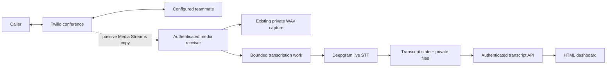

# Build 3 — live transcript dashboard

```sh
.venv/bin/python scripts/open_dashboard.py
```

Run this from the source checkout on the server Mac. It reads the installed service's private configuration and opens `/dashboard` with a browser login handoff; it does not print the token. The dashboard shows live Deepgram text and offers saved transcript exports. A phone test still needs to establish actual call transcription; a healthy page alone cannot prove it.

Build 3 adds speech-to-text to the existing two-human Twilio conference and passive audio capture. It sends enabled call audio to Deepgram Nova-3, presents interim/final text in HTML, and preserves transcript data for partner development. The caller's conversation remains connected through Twilio; Python observes a copy of the media.

**Acceptance status:** Build 3 code is implemented. All 255 automated tests pass. Generated speech passed the real Deepgram API and a full local Uvicorn signed-media/browser/export test, with both WAV tracks completed. **Actual phone capture/transcription remains pending.** These checks do not claim a Twilio phone call occurred. Check the deployed revision with `python3 scripts/server.py status` and `/health`.

## What this build supplies

| Interface | Purpose |
| --- | --- |
| Existing Twilio number | Connect the incoming caller to the configured teammate phone. |
| `/dashboard` | HTML view for live and saved transcripts; its data requires a private viewer token. |
| Authenticated `/api/transcripts` routes | List sessions, read a selected call, and export JSON or text. |
| Private transcript storage | Structured JSON outside release checkouts; readable text is exported through the authenticated viewer. |
| Existing capture/replay interface | PCM16 WAVs and typed offline audio frames for partners. |

This build transcribes speech; it does not classify deepfakes, run Gemini dialogue, synthesize an ElevenLabs voice, or implement keypad takeover. Those partner designs remain in [DEEPFAKE_DETECTION.md](DEEPFAKE_DETECTION.md), [VOICE_STACK.md](VOICE_STACK.md), and [IMPLEMENTATION.md](IMPLEMENTATION.md).

## Follow the media path



Twilio Media Streams exports mono μ-law at 8 kHz. The transcript path must declare the true codec and sample rate, while the existing recorder writes decoded PCM16 WAVs. Deepgram supports the raw μ-law telephone route through `wss://api.deepgram.com/v1/listen` with `encoding=mulaw`, `sample_rate=8000`, and `channels=1`. [Twilio format](https://www.twilio.com/docs/voice/media-streams/websocket-messages), [Deepgram's Twilio integration](https://developers.deepgram.com/docs/twilio-and-deepgram-stt).

| Direction label | Meaning | Limitation |
| --- | --- | --- |
| Caller input / `inbound` | The original caller's incoming audio | Includes background voices and possible speakerphone leakage. |
| Caller playback / `outbound` | Audio Twilio plays to that caller | Includes teammate conference audio, hold music, and prompts; not an isolated teammate microphone. |

The implementation opens a separate Deepgram WebSocket for each direction, each configured as mono. Two directions therefore create two provider streams. Preserve direction labels with every segment; do not merge the two raw tracks into a single mono stream or rename playback as a verified person. See [AUDIO_QUALITY.md](AUDIO_QUALITY.md) for what VoIP can improve and why it does not change this stream's 8 kHz export.

## Configure the installed server

Add these settings to the environment actually used by the server:

```dotenv
MEDIA_CAPTURE_ENABLED=true
TRANSCRIPTION_ENABLED=true
DEEPGRAM_API_KEY=replace_in_private_environment_only
DEEPGRAM_MODEL=nova-3
TRANSCRIPT_STORAGE_DIR=/absolute/private/path/to/transcripts
DASHBOARD_TOKEN=replace_with_a_random_viewer_token_at_least_32_characters
```

`TRANSCRIPTION_ENABLED` defaults to false. Keep the existing absolute `MEDIA_STORAGE_DIR` and capture configuration. Use a distinct random dashboard token; do not reuse the Twilio auth token, Deepgram API key, or deployment-control token. The browser needs only the viewer token, never provider credentials. The helper sends that token in a URL fragment, which the page immediately clears from the address bar before exchanging it for a session cookie; fragments are not part of the HTTP request target.

1. Put the settings in `~/Library/Application Support/NewCollegeOperator/.env` for the installed service. The source checkout's `.env` is separate; changing it does not configure the installed app.
2. Set an absolute transcript directory outside per-release checkouts, for example the installed service's `.runtime/transcripts` with the home directory fully expanded. Keep the directory private and excluded from Git.
3. Apply environment changes during an idle period using the [server controls](SERVER.md). A GitHub push changes app code; it does not install new private credentials. Explicitly restarting a busy service can interrupt active work.
4. Check `python3 scripts/server.py status` and `/health` to confirm the intended revision is active. Configuration readiness does not prove that Deepgram accepted a real audio stream.
5. Run `.venv/bin/python scripts/open_dashboard.py`, or open `/dashboard` and enter the viewer token manually. Select a call when one appears. Never put the token in a query string or publish the helper's private login URL.

Enabling transcription sends new enabled-call audio to Deepgram and can incur provider usage. It does not retroactively upload the existing recording archive. Set `TRANSCRIPTION_ENABLED=false` to stop new provider transcription while retaining the established Twilio/capture workflow.

## Read and reuse the output

Interim transcript text can change as more speech arrives. Use it for the live view; use finalized segments for saved exports and downstream partner processing. A finalized transcription is still a model prediction and can contain recognition errors.

Deepgram distinguishes finalized processed ranges (`is_final`) from endpointing boundaries (`speech_final`). Neither event makes a speaker's identity certain. The implementation retains track and media-time metadata and avoids duplicating finalized text when interim messages are revised. [Deepgram live response contract](https://developers.deepgram.com/reference/speech-to-text/listen-streaming).

### Viewer API and authentication

| Route | Contract |
| --- | --- |
| `GET /dashboard` | Serve the HTML/login interface without embedding transcripts or secrets. |
| `POST /dashboard/login` | Accept JSON `{"token": "private-viewer-token"}` and establish an eight-hour HttpOnly, SameSite=Strict session cookie. |
| `GET /api/transcripts` | Session metadata plus text for an automatically selected active/recent call. |
| `GET /api/transcripts?call_sid=<CallSid>` | Include finalized segments and interim text for the selected session. |
| `GET /api/transcripts/<CallSid>/export?format=json` | Export the selected call; use `format=txt` for readable text. |

The page polls selected-call data once per second; provider processing and network delay add to that refresh interval. It does not store the entered token in localStorage or sessionStorage. `POST /dashboard/logout` clears the viewer cookie.

API requests accept the viewer session cookie or `Authorization: Bearer <DASHBOARD_TOKEN>`. Use the bearer form for a local partner consumer and keep the token out of code, URLs, and logs. This shared viewer credential reads transcript data; it grants no deployment or call-control access.

JSON exports contain `schema_version`, `provider`, `model`, `sample_rate: 8000`, `track_meanings`, and the selected `session`. Text exports are generated from finalized segments. Downloads are authenticated even when someone knows a call SID.

### Stored and live data contract

The transcript API snapshot contains `schema_version`, `selected_call_sid`, `enabled`, `provider`, `model`, `revision`, `storage_error`, and `sessions`. Unselected sessions contain metadata with cleared segments/interim text; the selected call includes its text. When `call_sid` is absent or unavailable, the API selects the first active session, otherwise the first recent session. Always use returned `selected_call_sid` to identify that selection; it is null when no session exists. A session records `call_sid`, `stream_sid`, `started_at`, `ended_at`, `status`, `finish_reason`, and `storage_error`. Each `tracks.inbound`/`tracks.outbound` entry records its `meaning`, provider `status`, sanitized `error` code, and current `interim` text. Finalized `segments` contain `id`, `track`, `start_ms`, `end_ms`, `text`, and `confidence`.

For example, one **illustrative, not measured** final segment is:

```json
{
  "id": "example-segment-id",
  "track": "inbound",
  "start_ms": 8000,
  "end_ms": 9600,
  "text": "This is the caller speaking.",
  "confidence": 0.98
}
```

The confidence describes provider recognition output; it is not a speaker-authentication or deepfake score. Millisecond offsets refer to the call's media timeline. Inbound and playback speech can overlap, so a combined display must keep direction metadata rather than invent a single conversational turn order.

A top-level `storage_error` reports archive availability; each session also exposes whether its own file saved successfully. Treat either warning separately from recognition success.

Session statuses are `connecting`, `live`, `finishing`, `completed`, `partial`, and `failed`. A session can finish with usable segments even when one direction fails. Track-level status and session-level completion must both remain visible.

At finalization the server writes one private atomic JSON file at `TRANSCRIPT_STORAGE_DIR/<CallSid>.json`. In-progress state is served from memory; a process crash before finalization can leave no saved JSON for that call. New releases reuse the configured storage directory. Readable text exports are derived from finalized segments. Do not treat the live in-memory view as crash-persistent storage.

Partners can consume these separate artifacts:

| Input | Existing or new use |
| --- | --- |
| Capture `inbound.wav`, `outbound.wav`, and `manifest.json` | Preserve acoustic evidence and timing/quality metadata; use for detector development. |
| `integrations.AudioFrame` via `scripts/replay_capture.py` | Replay completed local PCM without contacting a provider. |
| Saved transcript JSON and downloadable text | Read finalized words, timestamps, and direction for UI, search, or future conversation-context work. |
| Live transcript API | Observe current recognized text with viewer authentication. |

The typed audio definitions are in [`integrations/contracts.py`](../integrations/contracts.py); the full offline contract is [PARTNER_HANDOFF.md](PARTNER_HANDOFF.md). Transcript words are not a replacement for audio in a deepfake detector. A future agent must also distinguish generated text, recognized text, and text actually played to the other party.

Saved data must distinguish a normal completion from a provider failure, truncated stream, or unfinished session. Missing text is not proof of silence. Keep any available completed segments when later transcription fails, but surface the failure instead of presenting the transcript as complete.

## Limits and retention

| Limit | Behavior |
| --- | --- |
| Two active transcription calls | Each uses separate inbound/outbound Deepgram sockets. Additional phone calls continue with visible transcription `capacity-limit` / `not-recorded` status. |
| 128 queued frames and 64,000 μ-law bytes per track | Either bound can be reached first. Overflow fails that STT track; the human call continues. |
| 2000 final segments / 100,000 text characters per session | Bound retained transcript output; each segment/interim is limited to 2000 characters. |
| Ten recent finished sessions | The in-memory view/reload is bounded; startup scans at most 1000 directory entries. This is not a deletion policy. |
| Private JSON under 2 MiB | Files use mode 0600 and directories 0700. A storage failure is shown separately from successful recognition. |

Capture's `MEDIA_MAX_SECONDS` also bounds transcription duration. Provider connection/send work and final-result flushing have timeouts. The per-track byte ceiling is approximately eight seconds of μ-law audio, but normal 20 ms packets reach the 128-frame ceiling sooner; do not assume every queue holds eight seconds.

Saved transcript and WAV files have **no automatic expiry or deletion**. Operators manage retention in the configured private roots. New deployments preserve these directories. A missing/partial archive warning must remain visible even when useful text can still be downloaded from the current process.

## Keep transcription separate from call control

The transcription connection and dashboard do not carry the audio that connects the humans. Each provider track has a bounded queue; queue overflow fails that transcription track instead of slowing the conference. Missing media intervals are filled with μ-law silence (`0xff`) to retain the timeline; those inserted samples are not observed speech. Provider errors become visible transcript status and do not hang up the conference or trigger an AI response.

Idle provider streams receive a `KeepAlive` control message every three seconds. At call end, the sender issues `CloseStream` and allows a bounded ten-second result tail before cleanup; a provider connection still being established can add its five-second connect deadline. A failed or incomplete tail must not be labeled a successfully complete transcript. The dashboard can show `finishing` while this final work runs.

| Failure to test | Expected result |
| --- | --- |
| Missing/bad Deepgram credentials | Configuration or provider failure is visible; no secret appears in browser/log output. |
| Provider timeout/disconnect | Existing finalized text remains usable with a failure/partial status; humans stay connected. |
| Slow consumer or queue exhaustion | Work is bounded and missing transcript coverage is explicit; no unbounded buffering. |
| Call hangup | Stop accepting audio and bound the final-result flush; close provider tasks and publish the final state. |
| Automatic deployment | Include transcription finalization in pending-work accounting before switching the app revision. |

Dashboard authentication is viewer access, not call-control authority. Knowing the public ngrok URL must not expose transcripts. Keep transcript APIs and downloads authenticated; do not put full transcript content or provider keys in public health responses.

## Verify this build

1. **Automated transport:** fake provider sockets produce correctly labeled interim/final segments without real credentials. Verify malformed messages, provider failures, bounded queues, and hangup cleanup.
2. **Viewer access:** missing/wrong tokens cannot list, read, or export transcripts. Recognized HTML-like text renders as text. The viewer token does not authorize deployment or Twilio operations.
3. **Real call when available:** call the Twilio number from a different phone, answer the configured teammate, and say distinct phrases on both sides for about 20 seconds. Confirm the recording notice and normal two-way audio.
4. **Transcript acceptance:** watch each phrase appear under the correct direction, hang up, and confirm the saved JSON/text matches finalized speech and reports the real completion state. Also inspect both original WAVs and the capture manifest.
5. **Failure isolation:** use a fake/unavailable provider in an automated test to prove the call/capture continue. Verify finalization counts return to zero so later GitHub deployments can proceed.

The phone portion takes about two minutes once the dashboard is unlocked and both phones are available. Record its outcome separately from synthetic socket tests. Build 1's successful phone bridge test does not establish Build 2 recording or Build 3 transcription correctness.

**Next partner task:** use one finalized transcript plus its matching capture manifest to build a read-only consumer. Keep detection and voice-agent execution behind their own later integration milestones.
