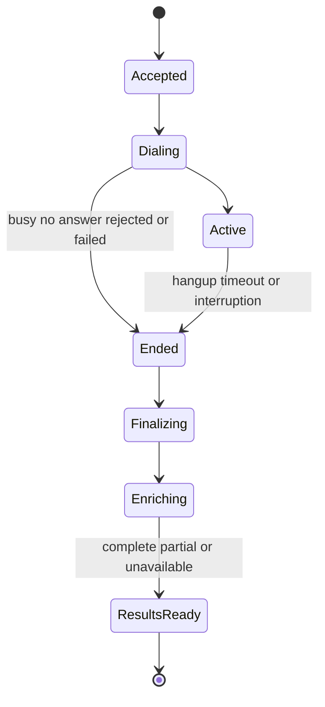

# Phoney ChatGPT Plugin Build Plan

Start with **Phase 1**. Build a provider boundary and durable call record before exposing call control to ChatGPT.

Design date: October 1, 2026. Baseline: `362969bd7c6a4b9f3d05c6ababb2a87cf8c124ef`. This document proposes implementation; it changes no live configuration. Read the [research report](CHATGPT_PLUGIN_RESEARCH.md) for source evidence and the audited feature inventory.

## Target behavior

All calls through the Phoney/Twilio number have a saved call record, recording/transcription status, audio detection status, summaries when usable speech exists, and persistent notes. Human calling works independently of ChatGPT. ChatGPT can initiate an authorized agent call, join an existing call, retrieve results, and write notes. Spoken GPT turns run in Phoney and use the existing ElevenLabs voices.

Ordinary iPhone SIM-number calls are outside scope. Dashboard outbound calling stays available through the current browser SDK. Dashboard inbound ringing is an optional later feature, not a dependency of this migration.

### Nonnegotiable product contracts

1. Existing inbound, owner-callback outbound, browser outbound and voicemail routes remain usable with ChatGPT closed.
2. Keypad agent selection and human resume remain usable without the plugin UI.
3. Human-only and agent-assisted calls receive the same archive and enrichment pipeline.
4. Caller audio detection stays independent of GPT; generated agent speech must not contaminate caller-only analysis.
5. Manual notes and historical results survive model changes, interrupted jobs and server restarts.

## Five implementation phases

Estimates are engineering effort for one developer familiar with the repository, including local verification. External access and review delays are excluded. **Total: approximately 20–32 working days**, plus any OpenAI eligibility or publication wait. This is a complete product migration, not a manifest-only change.

| Phase | Deliverable | Effort | Exit gate |
| --- | --- | --- | --- |
| 1 | Provider boundary, canonical records and OpenAI capability probe | 3–5 days | Existing routes still work; records and credentials survive restart |
| 2 | GPT dialogue, summaries and persistent notes | 5–7 days | Phone behavior and enriched results pass representative comparisons |
| 3 | Durable owner-absent agent calling and controlled actions | 4–7 days | Calls outlive UI sessions; duplicate requests do not redial |
| 4 | Private authenticated MCP plugin and results panel | 5–8 days | Private ChatGPT tests pass with correct permissions and independent phone service |
| 5 | Production canary, recovery checks and Gemini retirement | 3–5 days | All required workflows pass on the Mac mini; rollback and old archives remain valid |

Phases 3 and 4 can overlap after Phase 2. The plugin should first expose stable reads and existing agent controls; autonomous calling is advertised only after Phase 3 passes.

## Phase 1 Provider and persistence foundation

### Separate providers from conversation state

Extract Gemini-native history and request construction from [voice_stack/agent.py](../voice_stack/agent.py). Define application-owned turns with speaker, text, timestamp, trust/source and delivery evidence. Preserve published agent goals and boundaries separately from the shared voice delivery profile.

Proposed interfaces:

```python
class DialogueProvider:
    async def stream_reply(self, history, instructions, tools, cancellation): ...

class EnrichmentProvider:
    async def summarize(self, transcript, kind): ...
    async def extract_notes(self, transcript): ...
```

The event contract should represent text deltas, requested actions, terminal completion, classified failure and tracing. Keep request deadlines, bounded retries, maximum reply length and cancellation in the runtime. Provider adapters own wire events and credentials. Preserve the current Gemini adapter temporarily so the boundary can be verified before switching models.

### Create a canonical call identity

Add a `CallRepository` using the existing workspace storage backend. Start with additive schema changes and a verified importer mapping existing Twilio SIDs and archive files to canonical IDs. The single-workspace pilot uses explicit workspace ownership even before public tenancy exists.

The new repository becomes authoritative for call metadata, jobs and notes while initially referencing the existing SID-based assets. Import idempotently and retain existing asset readers, transcript fingerprints, authored summaries and Gemini provenance. Each component has one writer; the old summary manager and new runner must never claim the same enrichment work. Verify rollback to the old release before changing an asset format.

| Record | Required contents |
| --- | --- |
| Call | UUID, workspace, direction, entry point, initiation source, owner/remote/bot leg SIDs, timestamps, transport and outcome |
| Intent and mode | Authorized destination/goal, published agent revision, policy snapshot, persisted deadline, active mode, epoch and human availability |
| Assets | Recording manifests, track/gap evidence, transcript revisions, detection intervals and per-component status |
| Notes and enrichment | Manual notes with revisions; generated notes and two summaries with source fingerprints and provider/model provenance |
| Jobs and events | Stable idempotency key, lease, attempt budget, next retry, provider-create status and durable event outbox |

Use a workspace-scoped call UUID as the product identity; keep Twilio SIDs as transport identifiers. Do not overload the current SID-only archive format to represent a call with multiple legs. Persist enough metadata that history does not hardcode every direction as “Call.”

Proposed new modules are implementation choices, not existing files:

| Boundary | Proposed location | Responsibility |
| --- | --- | --- |
| Language models | `llm/providers.py`, `llm/openai_responses.py`, `llm/credentials.py` | Neutral contracts, Responses events, credential modes and refresh ownership |
| Call persistence | `call_repository.py` with workspace backend migrations | Call identity, metadata, policy, revisions and legacy asset references |
| Enrichment and notes | `call_notes.py`, `openai_enrichment.py` | Manual edits, generated evidence and validation; reuse the existing summary scheduler |
| Autonomous execution | `operator_service/jobs.py`, `operator_service/actions.py` | Leased jobs, reconciliation and policy-checked actions |
| ChatGPT surface | `mcp_service/`, `chatgpt-plugin/`, `public/plugin-call-panel.*` | OAuth-protected tools, protocol/package configuration and results UI |

Proposed component states are `pending`, `running`, `complete`, `partial`, `failed`, `unavailable` and `not_applicable`. Distinguish no speech from lost audio. Asset failures cannot block routing, but failed metadata persistence must produce an operational error rather than a fabricated success.

### Probe OpenAI access without changing phone routes

Choose an explicit credential mode: project API, or eligible ChatGPT-plan inference. Add a diagnostic that checks authorization, catalog parsing, chosen phone/enrichment models, a streamed text response, terminal completion and supported output settings. Record capability results without storing token values or private transcripts in diagnostic logs.

Plan eligibility is an unresolved gate. If it fails, configure project API usage with its own budget before continuing; do not repeatedly reauthorize an ineligible account or silently change billing. For a remote Mac mini, follow the documented local OAuth and protected-transfer procedure. [Plan recovery](https://developers.openai.com/siwc/token-sharing-open-source/errors-and-recovery), [remote authorization](https://developers.openai.com/siwc/token-sharing-open-source/self-hosted-vms).

Use the documented authorization flow with fresh state/nonce and PKCE, validate returned identity/grants, and persist issued client identity and credentials outside Git. A refresh owner serializes rotating refreshes and atomically replaces credentials. Keep OpenAI credentials out of browser storage, plugin tool results and logs. [Sign-in](https://developers.openai.com/siwc/token-sharing-open-source/sign-in), [token reference](https://developers.openai.com/siwc/token-sharing-open-source/token-reference).

**Phase 1 exit:** the current Gemini-backed system still behaves the same, every supported call path writes canonical metadata, archive import is verified, and the selected OpenAI route has a measured capability result.

## Phase 2 GPT dialogue and call products

### Implement the Responses adapter

Use a persistent HTTP client with SSE first. Convert application instructions/history into the chosen route's accepted request form. Retain provider output items needed for subsequent reasoning and tool turns. Plan mode must use streamed unstored requests, array input and instructions/developer messages; replay history rather than sending HTTP `previous_response_id`. Its function/custom tools use namespaces or `additional_tools`; hosted MCP/connectors are unsupported. Phoney executes actions locally. Enforce the route's parameter allowlist instead of copying Gemini parameters into OpenAI calls. [Plan request limits](https://developers.openai.com/siwc/token-sharing-open-source/preview-limitations).

Configure separate `PHONE_MODEL` and `ENRICHMENT_MODEL`. Set supported reasoning effort deliberately; current GPT family members do not all accept the same settings. Do not send unsupported sampling fields. Benchmark eligible models rather than automatically choosing the resolver's flagship. [Model migration guidance](https://developers.openai.com/api/docs/guides/latest-model/gpt-6-astra.md#migration-quickstart).

Feed text through the existing sentence buffer, one-phrase prefetch and ElevenLabs delivery path. Preserve epoch checks across generation, TTS preparation, enqueueing and playback acknowledgment. A cancelled or cleared phrase cannot be recorded as fully heard. Existing v4 per-phrase WebSocket continuity is a separately measured limitation, not a reason to alter the semantic agent prompt.

### Migrate both summary jobs

Inject the enrichment provider into [summaries.py](../summaries.py) and replace Gemini-only enablement with provider readiness. Preserve independent brief/detailed jobs, transcript fingerprints, bounded retry schedules and restart recovery. Broaden stored provenance to accept GPT while retaining old `gemini` and `agent` sources. Keep manual authoring precedence and existing archive compatibility.

Generated notes should use a validated schema, with explicit refusal/error handling and a bounded retry for invalid output. Verify structured-output support for the selected route before relying on it. Schema conformance alone does not prove factual accuracy. [Structured Outputs](https://developers.openai.com/api/docs/guides/structured-outputs).

| Note field | Persistence rule |
| --- | --- |
| Summary and topics | Derived from the finalized usable transcript and linked to its fingerprint |
| Decisions and commitments | Each item cites transcript segment IDs and times |
| Action items | Owner and deadline may be null; never infer a date or commitment absent from the call |
| Uncertainty | Preserve disputed speakers, transcription gaps and interrupted agent delivery |
| Manual notes | Separate author, revision and edit history; generated jobs never overwrite them |

Add persistent per-call note editing to the dashboard and repair contact-note normalization separately. Apply optimistic revisions to edits from dashboard and ChatGPT so one does not silently overwrite the other.

### Compare behavior before switching

Use consented/redacted representative inbound, outbound and voicemail transcripts for offline comparison. For live conversation, measure final caller speech to first audible agent response, p50/p95, interruptions, task completion and unsupported claims. Compare models with the same voice and transport. Agree on numerical latency/task-success gates using the measured baseline before enabling the canary; no current model-specific telephone latency result is assumed.

Post-call shadow enrichment can run without changing what callers hear. Live GPT audio needs a small explicit pilot; do not run two simultaneous speaking agents. Preserve a temporary provider rollback setting until Phase 5.

**Phase 2 exit:** GPT dialogue and both summary jobs work, persistent manual/generated notes exist, old Gemini archives remain readable, and switching provider does not alter calling, keypad or acoustic delivery behavior.

## Phase 3 Autonomous calling and live actions

Add an explicit `agent_outbound` session mode. The scheduler dials the destination from the Phoney number and attaches the agent without requiring an owner-phone or browser participant. Keep existing owner callback and browser modes unchanged. Reuse remote-only voicemail machinery only where its greeting, deadlines and termination policy fit the new mode.

The call runtime owns active media; the durable job owns intention, outcome and recovery. A closed ChatGPT panel, disconnected MCP request or closed dashboard cannot end an autonomous call. Browser human calls retain their existing disconnect behavior.

### Durable start and recovery



These are product lifecycle states; individual enrichment components carry their own statuses. Provider call creation also needs an `unknown` state: if a network timeout occurs after a create request, reconcile with Twilio before retrying. Never assume that timeout means no call was placed.

Persist intent and a per-leg dial-attempt identity before calling the provider. Enforce workspace plus idempotency key uniqueness, validate repeated request fingerprints, and fence stale workers before external effects. Signed callbacks bind to that attempt as well as known call/leg IDs; late callbacks cannot control a newer attempt. The same key with different arguments returns a conflict. Duplicate callbacks and plugin retries cannot create another call.

Lease expiry or inability to find a provider call is insufficient evidence to redial. Keep unresolved creation attempts `unknown` until reconciliation establishes an outcome; a new worker cannot simply repeat the external request. Escalate unresolved attempts for controlled recovery instead of claiming an exactly-once provider guarantee.

After process restart, reconcile provider legs, classify interrupted media, finalize available assets and resume post-call jobs. Enforce persisted policy deadlines on surviving legs, with provider-level duration protection where verified and supported. Current in-memory deadlines alone are insufficient for native calls that survive a process failure. The system cannot resume the old WebSocket/audio runtime from database state. Do not automatically redial an interrupted conversation without a separate authorized retry policy.

### Controlled agent actions

Expose typed backend actions rather than executing arbitrary model text. Initial actions are agent hangup, join/select a published agent, and human resume where an owner is available. Keep the existing delivered-final-reply condition on hangup. Requests to add contacts, redial or disclose other calls need separate permission checks.

Function calls request execution; the server validates policy and returns the matching `function_call_output`. Preserve original relevant response items when continuing a tool turn. Plan-route function schema support must be probed separately. [Function calling](https://developers.openai.com/api/docs/guides/function-calling).

Implement IVR digits only after a controlled Twilio prototype confirms outgoing digits and safe audio resumption. Preserve phone-owner keypad controls independently. The current native pilot's `*` menu is not identical to the live relay's `#N` controls; changing transport needs a deliberate usability gate.

**Phase 3 exit:** an agent can call with no owner present, results persist, restart recovery is truthful, cancellation stops future work, and repeated start requests produce one external call.

## Phase 4 Private ChatGPT plugin

### Server and authentication

Add a dedicated MCP router and maintained protocol library, sharing the call service rather than duplicating telephony logic. Keep it behind public HTTPS on the established deployment path. Validate which library version supports the required MCP Events protocol before choosing the event implementation. Do not advertise unsupported capabilities.

Provide OAuth 2.1 protected-resource and authorization-server metadata, PKCE, exact resource audience, workspace membership and bounded access tokens. Use an established OAuth implementation. Browser PIN cookies stay on dashboard routes; MCP bearer verification stays on dedicated routes. Signed Twilio callbacks retain their existing verifier. Do not disable the outer workspace gate broadly to make MCP requests pass. [Plugin authentication](https://developers.openai.com/plugins/build/auth).

Proposed scopes are `calls:read`, `calls:start`, `calls:control`, `notes:write` and `recordings:read`. Infer workspace from the token, never from an untrusted tool argument. If public distribution is later desired, enforce archive ownership across every transcript, WAV, detection result, note and download before onboarding another workspace.

### Tool contract

Each tool declares `readOnlyHint`, `destructiveHint` and `openWorldHint` explicitly. For arbitrary external destinations, `start_call` uses `false`, `true` and `true`, respectively. Read tools are bounded and paginated; hangup is cancellation with destructive effect. Host confirmation and backend policy both matter. [Tool annotations](https://developers.openai.com/plugins/plugin-guidelines).

| Tool group | Proposed tools | Required controls |
| --- | --- | --- |
| Start and stop | `start_call`, `end_call` | Approved destination/goal, idempotency key, duration/spend policy; end bound to call identity |
| Live mode | `join_agent`, `resume_human` | Published agent revision, expected mode epoch, authorized owner control |
| Find and inspect | `list_calls`, `get_call` | Workspace ownership, pagination, explicit component states |
| Call results | `get_transcript`, `get_summary`, `get_recording_link` | Bounded data, source evidence, short-lived workspace-bound media grants |
| Notes | `get_notes`, `update_note` | Manual/generated separation, expected revision and audit attribution |

`start_call` returns quickly with call ID, accepted state and a results link. It never holds a tool request open for the call's duration. Joining an existing call uses a distinct operation; it must not accidentally dial a second destination. Other callers cannot obtain workspace privileges by speaking instructions to the agent.

### UI and package

Create a small call-results panel with status, transcript, summaries, notes and authorized agent controls. Use the current documented plugin package and MCP configuration formats; include extension entry points and deep links as appropriate. [Package structure](https://developers.openai.com/plugins/build/plugins).

Preserve the external dashboard link for live browser audio. A ChatGPT iframe CSP allowlist does not establish microphone or WebRTC permission. Test embedded audio separately on the actual supported surfaces before offering it. Declare only required network, asset and frame origins. [UI reference](https://developers.openai.com/plugins/reference).

The UI may use an authenticated, reconnectable Phoney transport for live text updates if host/CSP tests pass. Otherwise use bounded authenticated tool refreshes. This UI fallback is not a claim that MCP Events supports polling.

### Completion notifications

Implement optional `call.completed` and `call.results.ready` subscriptions. `call.completed` says the telephone call ended and enrichment may be pending; `call.results.ready` identifies finished component states, including partial failures. Neither event includes raw transcripts or unrestricted audio URLs.

MCP Events requires persistent subscriptions and webhook delivery. Verify callback ownership, prevent private-address/redirect abuse, sign deliveries, deduplicate IDs, recheck authorization and retry transient failures within a budget. Expired or revoked subscriptions stop delivery. Event order may differ from call order; clients fetch current state. [MCP Events](https://developers.openai.com/plugins/build/mcp-events).

**Phase 4 exit:** private ChatGPT testing can read results, edit notes and request authorized controls; independent calling still works after unlinking the plugin. Public submission and commercial SIWC access remain separate optional milestones. [Private connection](https://developers.openai.com/plugins/deploy/connect-chatgpt), [publication requirements](https://developers.openai.com/plugins/deploy/submission).

## Phase 5 Production and Gemini retirement

Use the existing candidate-health, full-suite, admission-drain and rollback workflow on the Mac mini. Release code and additive schema support before enabling new provider or plugin flags. If supervisor configuration changes, handle its installation separately from an application commit. Validate the actual active commit and nonsecret provider/billing flags after promotion.

### Acceptance scenarios

Run these on the real number after the offline contracts pass. Each scenario checks recording, transcript, detection, summaries/notes and explicit partial statuses where applicable.

1. Incoming call rings the owner, supports relay keypad takeover/resume and falls back to voicemail when unanswered.
2. Owner-callback outbound and dashboard outbound connect, including microphone/audio checks on desktop and iOS Safari/Brave.
3. Human-only call produces archived products without starting a dialogue agent; edits survive restart and concurrent note updates conflict correctly.
4. ChatGPT-initiated agent call runs without an owner, survives panel closure, joins/resumes safely where supported and returns results after hangup.
5. Duplicate starts, delayed callbacks, barge-in and simulated provider/auth failures produce one call, accurate delivery evidence and recoverable or explicit failed jobs.

Testing must not place unsolicited calls; use controlled destinations and existing authorized pilot procedures. The full automated suite stays **below 100 collected cases**, including parametrization. The current baseline has 99. Replace redundant contracts as new behavior is introduced; do not hide a second test archive or large input matrix. Browser harnesses and mocked audio cannot substitute for phone listening tests. [Test policy](TESTING.md).

### Failure policy

| Failure | Required behavior |
| --- | --- |
| ChatGPT or plugin OAuth unavailable | Independent phone/dashboard calling continues; plugin shows linking/status failure |
| GPT authorization, quota or provider failure | Human calls continue; agent resumes an available human or gives a bounded fallback and ends safely; enrichment queues or records failure |
| Deepgram, capture or detector interruption | Conversation continues where transport permits; component becomes partial/unavailable with a visible gap; recovery is bounded |
| Mac mini process loss | Native human bridge may persist; relay may fail; reconcile legs and assets after restart without pretending media resumed |
| Unknown external call creation or event-delivery failure | Reconcile before redial; preserve event outbox, revoke/stop unrecoverable subscriptions and avoid duplicate effects |

### Remove active Gemini dependencies

Search active code, tooling and configuration for Gemini-specific readiness, model validation, SSE errors, summary provenance and UI substitutions. Switch all active inference paths, then remove unused Gemini adapters, active configuration and credentials. The current adapters use generic HTTP clients, not a dedicated Gemini SDK. Preserve history readers and old provenance; do not regenerate every old summary automatically.

| Area | Existing files to review |
| --- | --- |
| Dialogue and live runtime | [voice_stack/agent.py](../voice_stack/agent.py), [settings.py](../voice_stack/settings.py), [operator runtime](../operator_service/runtime.py), [relay](../voice_stack/relay.py) |
| Readiness and controls | [config.py](../config.py), [operator routes](../operator_service/routes.py), [agent controls](../operator_service/controls.py) and voice readiness checks |
| Enrichment and stored provenance | [summaries.py](../summaries.py), [gemini_summary.py](../gemini_summary.py), [call_details.py](../call_details.py) |
| UI and workspace state | [workspace_store.py](../workspace_store.py), [dashboard CRM](../public/dashboard-crm.js), note APIs and archived metadata |
| Tooling and deployment | Environment example, voice checks/evals, dependency locks, focused contracts and operator documentation |

Keep the old release and compatible data readers available for rollback during the canary. Once retirement passes, GPT failure uses the defined human/fallback policy rather than silently restoring Gemini or changing the bill payer.

**Phase 5 exit:** GPT is the active inference provider, Gemini is absent from active requests and readiness checks, every required workflow passes, old artifacts remain readable and the live Mac mini reports the intended release.

## Operational measurements

Record per-call generation/TTS/playback timestamps, caller-turn latency, mode transitions, asset gaps, job attempts and usage totals. Keep phone numbers, transcript text and credentials out of routine metrics. Provider request IDs can support private troubleshooting.

At the planned volume below 1,000 connected minutes monthly, report billed Twilio legs/conference/bot minutes, STT processed tracks, ElevenLabs usage, GPT tokens or authorized plan usage, detector usage and storage. Enforce configured per-call and monthly limits. A project API fallback requires a preconfigured visible billing policy; it must never activate invisibly after a plan limit.

## First implementation task

Create the provider-neutral dialogue contract and adapt the current Gemini path to it. Save canonical call metadata alongside the existing archives. Run the existing focused suite and verify that a human-only call remains independent of model credentials before switching any live model.
