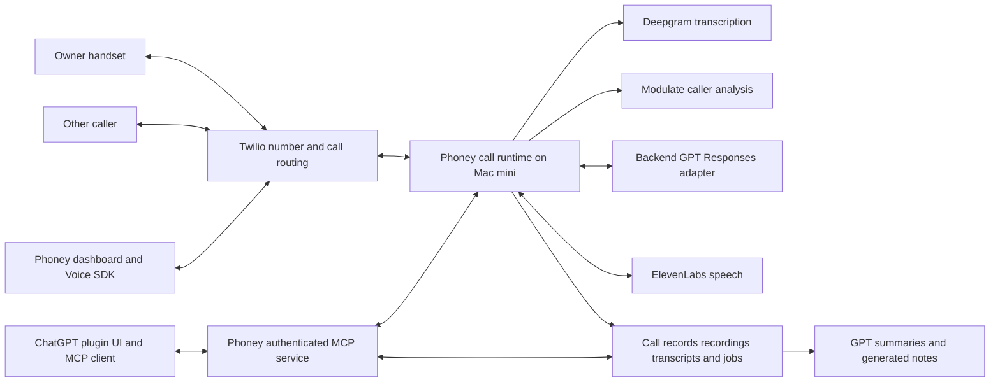

# Phoney ChatGPT Plugin Research

Read the [build plan](CHATGPT_PLUGIN_BUILD_PLAN.md) to start implementation. **Keep Phoney as an independent phone service, replace Gemini with backend GPT, and add ChatGPT as another way to use it.**

Checked October 1, 2026. This is a researched proposal, not a deployed migration. Repository and live-server baseline: `362969bd7c6a4b9f3d05c6ababb2a87cf8c124ef`.

## Decision

The requested product can retain inbound calls, outbound calls, browser calling, transcripts, summaries, audio detection, voicemail, and ElevenLabs agent takeover. ChatGPT should call Phoney's services through authenticated MCP tools; it should not own the telephone connection or generate each live spoken turn through a plugin tool.

Two desired capabilities need additional implementation: persistent call notes and outbound agent calls that do not require the owner to answer first. A plugin package alone adds neither. Preserving the feature set is achievable; promising every call will have a complete recording or transcript despite outages is not.

**Scope:** every call routed through the Phoney/Twilio number. This includes human-only calls and Phoney calls answered on the owner's handset. Ordinary calls directly through the iPhone SIM number are outside this plan, as confirmed by the owner.

| Keep | Change | Add |
| --- | --- | --- |
| Twilio number, existing phone and browser routes | Gemini dialogue and summary adapters become GPT adapters | ChatGPT plugin with MCP tools and call results UI |
| Deepgram transcription and Modulate caller audio analysis | Durable call identity and provider-neutral history | Persistent manual notes and generated action items |
| ElevenLabs voices, shared delivery profile and playback controls | Explicit OpenAI model and billing configuration | Owner-absent agent calls and durable call jobs |

There is no requirement to port the number, switch to Telnyx, or replace ElevenLabs to implement this migration. Those would be separate audio/telephony experiments.

## What is running today

The Mac mini reports the baseline commit above and healthy enabled browser calling, recording, transcription, voicemail, summaries, agent controls, and detection. The workspace access gate is enabled. These are configuration and health checks, not a new end-to-end phone test.

**Important routing distinction:** `BROWSER_VOICE_ENABLED=true`, while `NATIVE_CONFERENCE_ENABLED=false`. The browser uses the Twilio SDK and native conference path. The optional owner-phone outbound conference pilot is disabled; inbound operator calls retain the Python relay path. A plugin migration must preserve both paths before attempting another transport migration.

The latest vocal work is already in this baseline: `eleven_v4_turbo`, the shared relaxed conversational delivery profile, safer phrase buffering, one-phrase prefetch, and playback-aware interruption handling. Legacy REST requests receive `previous_text`; v4 currently opens separate dialogue WebSockets per phrase. Full-reply prosody continuity remains an audio improvement opportunity, not something GPT automatically fixes. See [voice code](../voice_stack/tts.py), [phrase buffering](../voice_stack/agent.py), and [live playback](../operator_service/runtime.py).

### Calling and control coverage

“Present” means implemented in the audited code. Live routing differences are identified separately above.

| Requirement | Current state | Migration obligation |
| --- | --- | --- |
| Inbound Phoney-number calls on the owner's phone | Present, including voicemail | Keep working with ChatGPT closed or disconnected |
| Outbound calls from the owner's phone or dashboard | Present; owner callback and browser routes | Retain both entry points and the same caller number |
| AI join, owner listen, human resume and barge-in | Present | Preserve agent selection, context, epochs and playback marks |
| Phone keypad controls | Relay supports `#1` through `#9`, `#0`, and `##` | Preserve the existing gesture; the optional native pilot uses `*` followed by its menu |
| Autonomous outbound calls without the owner answering | Missing | Add a distinct durable call mode; do not simulate it with an owner callback |

The browser token currently denies incoming browser calls. Dashboard outbound calling is preserved; dashboard inbound ringing would be an additional feature. Agent-driven IVR navigation is also unimplemented: the current text adapter rejects function calls, and the relay's remote digit sender is unwired. Twilio documents outgoing DTMF through TwiML `Play digits`, but bidirectional Media Streams cannot send outgoing DTMF. Conference pause, digit delivery, and resumption therefore need a transport prototype before IVR support is advertised. [Twilio Play](https://www.twilio.com/docs/voice/twiml/play), [Media Streams](https://www.twilio.com/docs/voice/media-streams).

### Call products coverage

| Requirement | Current state | Migration obligation |
| --- | --- | --- |
| Live and saved transcription | Deepgram integration present | Keep speaker attribution and reconnect/gap evidence |
| Recordings and playback | WAV tracks, manifests and downloads present | Retain authorized access and track completeness |
| Summarization on calls | Brief and detailed Gemini jobs present | Migrate both jobs; preserve old results and retry behavior |
| Persistent note-taking | Manual call notes and structured generated notes absent | Add separate editable notes and transcript-grounded action items |
| AI audio detection | Caller-only Modulate live and archive analysis present | Keep it separate from the language model; historical backfill must never trigger live takeover |

Generated agent text is stored with delivery metadata. It is not a retranscription of the audio heard by the other person. Interrupted phrases cannot establish that every generated word was spoken. Summaries and notes must respect that distinction.

Contact notes are only partially wired: the store accepts a `note` field but drops it during normalization, and the dashboard has no persistent notes editor. The migration should fix this without treating contact notes as a substitute for per-call notes. [Workspace store](../workspace_store.py), [dashboard CRM](../public/dashboard-crm.js).

### Integration and persistence coverage

| Requirement | Current state | Migration obligation |
| --- | --- | --- |
| Contacts, agent drafts and archive history | Present | Keep dashboard usability and read older Gemini artifacts |
| Direction, entry point and goal in saved call history | Incomplete | Save canonical metadata instead of inferring it from temporary sessions |
| Durable autonomous jobs and restart reconciliation | Absent | Add jobs, leases, idempotency and explicit interrupted outcomes |
| ChatGPT tools and account linking | No MCP endpoint, OAuth service or plugin package | Implement these as a new authenticated surface |
| Multiuser archive isolation | One shared workspace; archives not fully tenant-scoped | Keep the pilot private; require ownership enforcement before public multiuser distribution |

## Recommended architecture



The diagram describes service ownership, not identical media routing for every call. Browser human audio can stay on Twilio's native bridge, with observer streams and a separate AI participant. The current inbound relay still depends on the Mac mini for its audio path.

For a spoken agent turn, keep the chain **caller audio → Deepgram text → backend GPT text → ElevenLabs audio → Twilio**. OpenAI describes chained voice agents as a supported architecture alongside its audio-native alternatives. This fits the existing voice identity, transcript controls, and interruption logic. [Voice agents](https://developers.openai.com/api/docs/guides/voice-agents).

“ChatGPT hops on” means ChatGPT requests an agent join with a goal, selected published agent, and authorized boundaries. Phoney supplies call context and runs subsequent spoken turns independently. The voice remains ElevenLabs. Closing ChatGPT must not end that agent call.

Human-only calls use the same recording, transcription, detection and post-call enrichment pipeline. A GPT dialogue session is unnecessary until takeover begins. Live operator sessions and post-call jobs must have independent lifetimes.

## Why GPT Live is optional

Replacing Gemini's text reasoning does not require `gpt-live-1`. GPT Live is a different voice architecture with its own backend integration and audio billing. Keeping ElevenLabs means GPT supplies words and controlled actions while ElevenLabs supplies the voice. Treat GPT Live or another speech model as a later listening and latency experiment. [GPT Live](https://developers.openai.com/api/docs/guides/live).

Choose the phone and enrichment models separately. The current official latest-model resolver returned `gpt-6-astra`; that identifies a current migration reference, not the best measured phone model. Benchmark an eligible low-latency candidate against a stronger candidate using the same ElevenLabs voice, call transcripts and task goals. Use configurable model IDs and verify availability through the appropriate account catalog. [GPT model migration](https://developers.openai.com/api/docs/guides/latest-model/gpt-6-astra.md#migration-quickstart).

Start with streamed Responses over HTTP and a reusable connection pool. Consume typed text and terminal events; text deltas alone do not establish successful completion. The application retains conversation state and cancels stale replies. [Streaming Responses](https://developers.openai.com/api/docs/guides/streaming-responses).

Persistent Responses WebSockets may reduce continuation overhead in long tool workflows. Their documented benefit is not a telephone latency guarantee. Add this optimization only if measurements justify it and the chosen credential route supports it. [WebSocket mode](https://developers.openai.com/api/docs/guides/websocket-mode).

## What the Pro plan can cover

The owner's paid ChatGPT plan is relevant, but it does not automatically authorize the Phoney server. Current Sign in with ChatGPT documentation permits eligible plan-backed inference for participating open-source or locally hosted apps. Access also depends on client/account eligibility; paid or remotely hosted products follow a separate access path. **Phoney's actual grant has not been tested.** [Plan usage overview](https://developers.openai.com/siwc/token-sharing-open-source), [SIWC quickstart](https://developers.openai.com/siwc/quickstart).

| Billing mode | Suitable use | Gate before enabling |
| --- | --- | --- |
| `chatgpt_plan` | Eligible personal deployment using the owner's authorized plan | Complete supported OAuth and verify account models, inference and recovery |
| `project_api` | Conventional server inference with an OpenAI project API key | Set a project budget, model access and explicit cost policy |

For plan inference, the documented API is `https://api.openai.com/v1/responses` with OAuth bearer credentials, `store:false` and `stream:true`. Its model catalog uses returned `models[].slug`, display name, visibility and order; do not parse it as the project API's catalog. [Models and inference](https://developers.openai.com/siwc/token-sharing-open-source/models-and-inference).

Plan-backed requests currently exclude audio input, transcription and several standard Responses fields and hosted tools. They require application-owned HTTP history replay. This is a strong reason to retain Deepgram, ElevenLabs and Phoney's local action execution. It also means a successful text grant proves no GPT Live entitlement. [Preview limitations](https://developers.openai.com/siwc/token-sharing-open-source/preview-limitations).

The documented remote-host flow uses local authorization, protected credential transfer, and remote refresh ownership. Use that flow if eligibility is confirmed; do not borrow a saved Codex token or use undocumented endpoints. [Self-hosted VMs](https://developers.openai.com/siwc/token-sharing-open-source/self-hosted-vms).

Pro lacks the Plus shared five-hour usage limit described in the current documentation, but this does not establish unlimited Phoney usage. Handle revocation, authorization expiry and account/app restrictions. Never invisibly switch a plan-backed request to paid project inference. [Accounts and sessions](https://developers.openai.com/siwc/token-sharing-open-source/profiles-and-sessions), [Errors and recovery](https://developers.openai.com/siwc/token-sharing-open-source/errors-and-recovery).

## What the ChatGPT plugin adds

Current OpenAI plugin documentation describes MCP tools, UI components and extensions; the requested link is a current integration surface. Phoney can expose call status, transcripts, summaries, notes and agent controls in a panel, with deep links to the full dashboard. [Plugin concepts](https://developers.openai.com/plugins/concepts/plugins), [Plugin Extensions](https://developers.openai.com/plugins/build/extensions).

Phoney must run an authenticated MCP service reachable by ChatGPT. This plan uses the existing public HTTPS deployment; private developer testing can alternatively use Secure MCP Tunnel. A plugin package describes the service and UI but does not deploy them. Defer public publication until tenancy, authentication and product behavior have been reviewed. [Plugin packaging](https://developers.openai.com/plugins/build/plugins), [Connect and test](https://developers.openai.com/plugins/deploy/connect-chatgpt).

**Two authorizations are separate:** ChatGPT links to a Phoney account through Phoney OAuth, while Phoney may separately obtain an OpenAI inference grant. The commercial “Continue with ChatGPT” plugin modal is gated and is not required for ordinary plugin account linking. [Plugin authentication](https://developers.openai.com/plugins/build/auth), [SIWC inside a plugin](https://developers.openai.com/siwc/chatgpt-plugin).

The examined docs do not establish microphone or WebRTC permission inside the ChatGPT iframe. Preserve the external dashboard dialer as the guaranteed browser-calling interface. Embed status and controls first; embed live calling only after desktop, web and mobile permission tests. Existing iOS Safari and Brave support must remain an external-dashboard acceptance requirement. [ChatGPT UI](https://developers.openai.com/plugins/build/chatgpt-ui).

MCP Events can deliver asynchronous call-completion and summary-ready updates. They require MCP 2.0 protocol `2026-07-28` and webhook subscriptions; this integration does not support event polling or event streaming. Keep live transcript updates on a separate Phoney UI transport, with authenticated status tools as a fallback. [MCP Events](https://developers.openai.com/plugins/build/mcp-events).

## Reliability and audio limits

The plugin must not be required for ringing, answering, talking, recording, transcription, detection, keypad takeover or voicemail. Losing plugin OAuth affects the ChatGPT surface. Losing GPT affects agent speech and enrichment. Neither failure should disable ordinary human calling.

Native human bridges can continue if an observer fails. The existing inbound relay has a stronger dependency: a Mac mini failure can interrupt audio. A later native inbound implementation could improve this, but it is additional transport work. Durable records can reconcile interrupted calls after restart; they cannot reconstruct missing audio or resume a crashed live media connection.

Twilio Media Streams use 8 kHz mono mu-law audio. GPT text migration does not change that media ceiling, and replacing the language model does not establish improved carrier call quality. Keep browser codec telemetry and separate source-quality checks from telephone-route checks. [WebSocket messages](https://www.twilio.com/docs/voice/media-streams/websocket-messages).

For every attempted call, save a record and explicit recording/transcript/detection/enrichment status. Busy, unanswered and speechless calls should say why a transcript is absent. A partial recording or failed provider must never appear as a successful complete artifact. Twilio status and recording callbacks provide lifecycle signals; verify signatures and reconcile duplicate or delayed callbacks. [Voice webhooks](https://www.twilio.com/docs/usage/webhooks/voice-webhooks).

## Security and cost decisions

The first plugin is private and operates one workspace. The existing PIN cookie protects the dashboard; it is not an MCP identity. Implement resource-scoped OAuth without weakening dashboard same-origin checks or exposing an administrator secret. Caller speech and transcript text are untrusted data, including speech that tells an agent to change its goal, disclose records or dial another number.

Use tool annotations to describe read/write, destructive and external effects, then enforce permissions at the server. An outbound call needs an authorized goal, destination, cost/duration policy and stable idempotency key. Recording links should be short-lived and workspace-bound. [Plugin guidelines](https://developers.openai.com/plugins/plugin-guidelines).

The planning volume is under 1,000 connected minutes per month. Budget with actual billed legs and bot minutes, not one price per conversation:

```text
monthly cost = number rental
             + Twilio human legs + conference and bot legs
             + Deepgram processed audio + ElevenLabs speech usage
             + GPT project tokens OR eligible plan usage
             + detector usage + storage and hosting
```

No current vendor quote or guaranteed savings is asserted here. Capture usage per call and set an explicit spend cap. The ChatGPT plan does not pay the telephony, ElevenLabs or detector bills. Reuse existing components first so the migration can measure its own effect.

## Build readiness

The next deliverable is a provider boundary and durable call record, followed by GPT dialogue and enrichment. Preserve historical Gemini summaries, the shared ElevenLabs delivery profile, existing calling entry points and the complete suite limit of fewer than 100 collected cases. The baseline contains 99 cases; recorded release validation was 96 passes and three explicit PostgreSQL skips. No additional runtime test or phone call was performed for this document.

The [build plan](CHATGPT_PLUGIN_BUILD_PLAN.md) specifies five phases, data contracts, tool permissions, failure behavior and deployment gates. Account eligibility, actual spoken-turn latency, embedded audio permissions and reliable IVR digit delivery remain verification gates, not assumed features.
