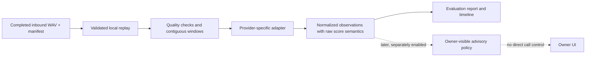
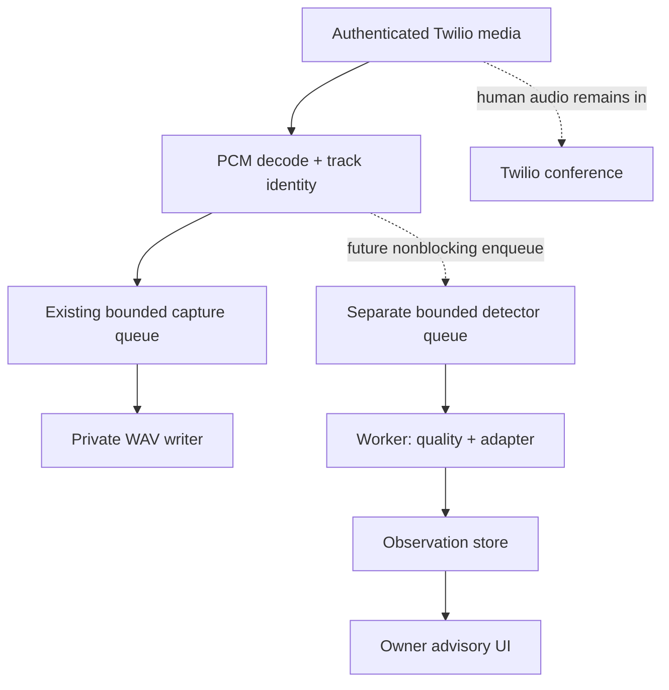

# Build the deepfake detector from the captured caller audio

Start with [the Modulate batch adapter](MODULATE.md) and one authorized, completed `inbound.wav`. Verify its returned frames before connecting a detector to a live call. You can develop with local human/synthetic fixtures while the real Build 2 phone-capture test remains pending.

**Status: technical implementation plan for partners, checked September 26, 2026.** Build 2 already supplies Twilio capture and offline replay. None of the detectors, queues, endpoints, configuration variables, or partner modules proposed below runs in the server today. This documentation adds no model dependencies and uploads no recordings. The code blocks are implementation examples, not evidence of successful provider calls.

## Choose a concrete first implementation

Use **Modulate Velma-2 synthetic-voice detection**, first through its batch endpoint and then, after testing, its native streaming endpoint. It has a documented per-frame acoustic verdict and accepts an 8 kHz streaming format compatible with our PCM interface. The detailed request/response examples are in [MODULATE.md](MODULATE.md), based on the [batch reference](https://docs.modulate.ai/api-reference/svd/batch) and [streaming reference](https://docs.modulate.ai/api-reference/svd/streaming).

Keep **Gemini + ElevenLabs** for the separate conversational agent: Gemini chooses words and approved actions; ElevenLabs speaks them in the enrolled owner's voice. Gemini can later explain a detector's structured observations, but asking an LLM whether a transcript sounds like a bot is not an acoustic deepfake detector. The [voice stack guide](VOICE_STACK.md) implements that distinction. The [ShellHacks prize page](https://www.mlh.com/events/shellhacks-b9/prizes) lists both sponsor categories; actual API use belongs in the later working demo.

| Option | Integration route | Why use it here | Main qualification |
| --- | --- | --- | --- |
| **Modulate** | HTTP file upload; separate native WebSocket detector | First choice: direct 8 kHz PCM streaming path and timestamped verdicts | Confidence belongs to a categorical verdict; preserve it unchanged. |
| **Resemble Detect** | File API or documented live WebSocket API | Alternative hosted detector with live result messages | Its streaming format and running aggregate differ from Modulate; use a separate adapter. |
| **Reality Defender** | File upload and asynchronous result polling | Alternative for recorded-call evaluation | SDK and REST score scales differ; unsupported or unsuitable input can abstain. |
| **AASIST research model** | Local Python/PyTorch wrapper | Offline baseline when provider access is unavailable | Old research checkpoint, 16 kHz input; no claim of modern phone-call accuracy. |

Exact alternative contracts, access requirements, source links, and code are in [DETECTION_ALTERNATIVES.md](DETECTION_ALTERNATIVES.md). Do not pass one provider's body, credentials, or score thresholds into another provider's adapter.

### What the detector can and cannot establish

| Question | Required evidence | Meaning in this product |
| --- | --- | --- |
| Does this interval contain synthetic speech? | Acoustic detector operating on audio | This document's task. Report qualified evidence for a time interval. |
| Is a conversational AI deciding what to say? | Separate behavioral analysis, with its own evaluation | A human reading AI-written text can have natural acoustics. Synthetic speech can read a fixed script. |
| Is the speaker the person they claim to be? | Enrollment and a separately designed identity/authentication system | Neither a natural-speech verdict nor caller ID proves identity. |
| Is the call malicious? | Context and an independently evaluated policy | Accessibility TTS and legitimate assistants also produce synthetic speech. |

Name the UI observation **“synthetic speech signal”**, with a time range and status. Avoid “caller is fake,” “verified human,” or a fabricated certainty percentage. Detection must not silently enroll someone's voice or trigger a cloned response. Owner keypad takeover remains a separate feature.

## Use the audio the repository actually supplies

Read [PARTNER_HANDOFF.md](PARTNER_HANDOFF.md) before writing the adapter. The implemented contracts live in [`integrations/contracts.py`](../integrations/contracts.py) and [`integrations/replay.py`](../integrations/replay.py).

| Property | Actual Build 2 contract | Detector consequence |
| --- | --- | --- |
| Input track | `inbound`: original caller's incoming audio | Analyze this track for incoming-caller observations. It can still contain background speech or speakerphone leakage. |
| Playback track | `outbound`: everything played to that caller | Do not mix it into incoming-caller analysis. It includes the teammate, prompts, music, and eventually our own synthetic voice. |
| Format | Mono, 8000 samples/second, signed PCM16 little-endian | A second contains 16,000 bytes after μ-law decoding. A 20 ms replay frame normally contains 320 bytes. |
| Time | `timestamp_ms` from the start of the stream timeline | These are media offsets, not UTC timestamps or original packet arrival times. |
| Availability | Completed WAVs plus final manifest; offline replay | No live consumer or detector route is registered in the app. |

Twilio's stream wire payload is base64-encoded raw μ-law at 8 kHz. Build 2 already decodes it to PCM before partners see it. **Do not μ-law-decode `AudioFrame.pcm_s16le` again.** Do not send a WAV header to a raw-PCM WebSocket, and do not label raw PCM bytes `audio/wav` in a file upload. [Twilio media payload contract](https://www.twilio.com/docs/voice/media-streams/websocket-messages).

The inbound stream is a call leg, not a diarized identity. If two people share a speakerphone, the detector sees both. An outbound call added in a later build needs an explicit mapping from the remote party's leg to the detector source; the string `inbound` alone does not mean “the dealership” in every future architecture.

### Preserve the narrowband evidence

Upsampling 8 kHz audio to 16 kHz can satisfy an input-format requirement; it cannot recreate frequencies removed by the phone path. Save the original capture, record every conversion, and evaluate the converted phone audio rather than quoting a wideband benchmark. The ASVspoof challenges explicitly separate channel variation and speech-deepfake conditions; their downloadable evaluation audio is not a measurement of our Twilio deployment. [ASVspoof 2021 tasks and data](https://www.asvspoof.org/index2021.html).

For a provider or local model requiring 16 kHz, an explicit conversion example is:

```bash
ffmpeg -nostdin -i inbound.wav -ac 1 -ar 16000 -c:a pcm_s16le detector-input.wav
```

Use a new output filename. Store `source_sample_rate: 8000` and `submitted_sample_rate: 16000` in the observation. Avoid denoising, pitch shifting, automatic gain enhancement, or silence splicing in the initial baseline: those transformations change the evidence. Evaluate any later preprocessing as its own versioned experiment.

## Build offline before adding live hooks



The first partner process can run synchronously over a completed file. HTTP latency cannot affect an already completed call. It must still bound its input, requests, retries, and output. Once the offline contract and accuracy tests work, reuse the result types in an isolated live worker.

### Files to add in the partner implementation

These paths are **proposed**, not existing commands:

```text
partner_detection/
    __init__.py
    types.py                # Window, observation, error, provider protocol
    windows.py              # Track selection, bounded buffers, quality metadata
    modulate.py             # Verified batch and streaming adapters
    policy.py               # Advisory aggregation; never a Twilio client
scripts/detect_capture.py   # Explicit local CLI; disabled unless invoked
tests/test_detection.py     # Fixtures, MockTransport, timeline/policy tests
```

Keep optional detector packages in a partner requirements file and separate virtual environment until an integration review. Do not add Torch, SDKs, or provider initialization to `main.py` merely to prototype. The current replay API requires no network account.

An initial partner milestone is 2–4 hours for offline windows, the HTTP adapter, and mocked tests if credentials are ready; allow another 4–8 hours for a useful labeled evaluation and 4–8 hours for live worker isolation. Account approval, collecting phone examples, and validating accuracy are separate work and can take longer. These are planning estimates, not measured completion times.

### Proposed configuration

```dotenv
# Partner process only. These names are NOT read by the current server.
DETECTION_ENABLED=false
DETECTION_MODE=offline
DETECTION_PROVIDER=modulate
DETECTION_TRACK=inbound
DETECTION_WINDOW_MS=8000
DETECTION_HOP_MS=8000
DETECTION_MAX_INFLIGHT=2
DETECTION_MAX_PENDING=2
DETECTION_REQUEST_DEADLINE_SECONDS=20
DETECTION_MAX_AUDIO_SECONDS_PER_CALL=120
DETECTION_RESULT_TTL_SECONDS=30
DETECTION_POLICY=observe_only
MODULATE_API_KEY=replace_in_private_environment_only
```

These are initial engineering limits, not provider requirements or tuned detector thresholds. Eight-second nonoverlapping batches keep boundaries simple and avoid paying repeatedly for the same speech. Modulate internally returns its own frame intervals; do not manufacture one provider score per eight-second upload. For a later native stream, batch window/hop settings do not control the server's model windows.

Validate the configuration at startup. Require explicit opt-in before transmitting local recordings to a provider. Store secrets outside Git and redact authenticated WebSocket URLs. Choose a private output directory under `.runtime/`; the existing Git ignore rules cover it. A document suggesting API use is not permission to upload every historical recording automatically.

## Windowing that preserves time and bounds memory

For the first offline experiment, inspect the completed manifest, select inbound frames, accumulate eight seconds, and wrap each contiguous interval in a real WAV container. Send one window at a time through the batch adapter. Preserve the original offsets: `call_start_ms = window_start_ms + provider_start_ms`.

**Capture-quality rule:** the current manifest gives an aggregate `gap_samples`, not the locations of inserted silence. If inbound `gap_samples > 0`, the initial baseline abstains on the whole capture. Otherwise it could misinterpret padded time as known natural silence. Replay only accepts completed captures, but “completed” does not imply zero padding. A later manifest version can include per-gap intervals and let the detector skip affected windows precisely.

The following self-contained example can be copied into `partner_detection/windows.py`. It uses only the implemented replay contract and Python's standard library. It returns data; it does not upload audio, create files, or run a detector.

```python
from dataclasses import dataclass, field
from io import BytesIO
import json
from pathlib import Path
import wave

from integrations.replay import iter_audio_frames, read_completed_capture

SAMPLES_PER_MS = 8
BYTES_PER_SAMPLE = 2

@dataclass(frozen=True)
class Window:
    session_id: str
    stream_id: str
    start_ms: int
    end_ms: int
    wav: bytes = field(repr=False)

def as_wav(pcm: bytes) -> bytes:
    if len(pcm) % 2:
        raise ValueError("PCM16 requires whole samples")
    output = BytesIO()
    with wave.open(output, "wb") as audio:
        audio.setnchannels(1)
        audio.setsampwidth(2)
        audio.setframerate(8000)
        audio.writeframes(pcm)
    return output.getvalue()

def inbound_windows(manifest_path: str | Path, window_ms: int = 8000):
    if type(window_ms) is not int or not 4000 <= window_ms <= 60000:
        raise ValueError("Use 4–60 second partner windows")
    capture = read_completed_capture(manifest_path)
    # The reader has bounded and validated the manifest and both WAV files.
    with capture.manifest_path.open("rb") as source:
        metadata_bytes = source.read(65537)
    if len(metadata_bytes) > 65536:
        raise ValueError("Manifest changed beyond its size limit")
    metadata = json.loads(metadata_bytes)
    inbound = metadata["tracks"]["inbound"]
    gaps = inbound.get("gap_samples")
    counters = metadata.get("counters", {})
    if type(gaps) is not int or gaps != 0:
        raise ValueError("unknown: capture padding or missing gap metadata")
    if any(type(counters.get(k)) is not int or counters[k] != 0
           for k in ("dropped_messages", "rejected_messages")):
        raise ValueError("unknown: capture loss or missing quality metadata")

    target_samples = window_ms * SAMPLES_PER_MS
    target_bytes = target_samples * BYTES_PER_SAMPLE
    pending = bytearray()
    next_sample = 0
    start_sample = 0
    for frame in iter_audio_frames(capture, frame_ms=20):
        if frame.track != "inbound":
            continue
        if frame.timestamp_ms * SAMPLES_PER_MS != next_sample:
            raise ValueError("unknown: noncontiguous replay timeline")
        next_sample += frame.sample_count
        pending.extend(frame.pcm_s16le)
        while len(pending) >= target_bytes:
            pcm = bytes(pending[:target_bytes])
            del pending[:target_bytes]
            yield Window(capture.session_id, capture.stream_id,
                         start_sample // SAMPLES_PER_MS,
                         (start_sample + target_samples) // SAMPLES_PER_MS,
                         as_wav(pcm))
            start_sample += target_samples

    # Require at least 4 seconds of final audio for this baseline policy.
    # This is stricter than some providers' minimum accepted duration.
    if len(pending) >= 4000 * SAMPLES_PER_MS * BYTES_PER_SAMPLE:
        yield Window(capture.session_id, capture.stream_id,
                     start_sample // SAMPLES_PER_MS,
                     (start_sample + len(pending) // 2) // SAMPLES_PER_MS,
                     as_wav(bytes(pending)))
    # The CLI must record a shorter remainder as unscored, not natural speech.
```

Process this generator lazily. `list(inbound_windows(...))` retains all audio and defeats the bounded-memory design. Keep at most two pending windows when introducing concurrency. The returned end offset truncates sub-millisecond residual samples; retain exact sample offsets too if later evaluation needs sample-level alignment. Use completed immutable captures; do not allow another process to replace a manifest or WAV while it is being evaluated.

The example deliberately stops on uncertain capture quality. The future CLI should catch that validation error and write a fixed `unknown` reason, without starting a provider request. Distinguish an invalid path or manifest from a valid but unusable audio clip in its exit status/report.

### Add speech and audio-quality gates

Do not classify a silent phone line as a human. Compute metadata on the unmodified PCM, and keep the same original sample interval when uploading. Voice activity detection selects useful windows; it is not itself a deepfake detector.

| Check | Initial policy to evaluate | What to store |
| --- | --- | --- |
| Capture padding/loss | Abstain on the whole capture until per-gap intervals exist | Original manifest gap/drop/reject counts |
| Usable speech | Begin with at least 2 seconds of voiced audio in an 8-second window | Voiced milliseconds, VAD model/version, threshold |
| All silence / no-content | No verdict about authenticity | `unknown`, reason `no_usable_speech` |
| Clipping | Flag unusually frequent samples near full scale; tune on fixtures | Clipped-sample ratio and threshold version |
| Crosstalk, hold music, channel noise | Mark ambiguous input; do not force a binary answer | Quality flags and any provider abstention |

The two-second gate is a test starting point, not a measured accuracy requirement. A VAD does not establish single-speaker purity. Silero VAD supports 8 kHz and 16 kHz; its streaming interface expects its own frame sizes, so reblock our 20 ms frames and reset VAD state at stream boundaries. Verify the pinned version's wrapper rather than assuming a Twilio packet is already a valid VAD input. [Silero sample-rate support](https://github.com/snakers4/silero-vad/wiki/FAQ), [official wrapper implementation](https://github.com/snakers4/silero-vad/blob/master/src/silero_vad/utils_vad.py).

Do not join separated speech snippets into one artificial utterance merely to hit a minimum duration. That hides pauses, moves timestamps, and changes the detector input distribution. Retain contiguous audio and let quality gating or the provider abstain.

## Define a result contract before wiring a UI

Normalize **metadata and verdict categories**, not every provider score into a pretend probability. The envelope below is our proposed application schema. It is not a Modulate response and is not emitted by Build 2.

```json
{
  "schema_version": 1,
  "observation_id": "local-unique-id",
  "session_id": "CA-example",
  "stream_id": "MZ-example",
  "stream_epoch": 0,
  "track": "inbound",
  "window": {"start_ms": 8000, "end_ms": 16000},
  "evidence": {"start_ms": 12000, "end_ms": 16000},
  "source_sample_rate": 8000,
  "submitted_sample_rate": 8000,
  "provider": "modulate",
  "model": "velma-2-synthetic-voice-detection",
  "provider_model_version": null,
  "adapter_version": "git-commit-of-partner-implementation",
  "status": "ok",
  "verdict": "synthetic",
  "provider_verdict": "synthetic",
  "score": {"value": 0.87, "kind": "verdict_confidence"},
  "calibrated_synthetic_probability": null,
  "quality": {"gap_samples": 0, "voiced_ms": null, "flags": []},
  "latency_ms": 420,
  "received_at": "2026-09-26T12:00:00Z",
  "expires_at": "2026-09-26T12:00:30Z",
  "policy_version": "observe-only-v1",
  "reason": null
}
```

All values above are **illustrative**, including latency; they are not measurements. The outer window is the submitted audio interval. `evidence` is one returned provider interval mapped onto the call timeline. Emit multiple observations for a response with multiple frame results. Keep null for an undisclosed provider version; the family name is not a reproducible checkpoint identifier.

| Field/rule | Requirement |
| --- | --- |
| `status` | `ok`, `abstained`, `error`, or `stale`; never turn a timeout into `natural`. |
| `verdict` | `synthetic`, `natural`, or `unknown`; a provider's natural result remains qualified evidence, not identity verification. |
| `score.kind` | Preserve `verdict_confidence`, `synthetic_score`, or `bonafide_logit` as appropriate. Never average unlike scales. |
| Time and identity | Carry call, stream, epoch, track, and interval through every request; reject results bound to another stream. |
| Provenance | Record adapter version, input transform, policy version, and provider's returned model version when available. |

For Modulate, map `non-synthetic` to application `natural` and `no-content` to `unknown`/`abstained`. Preserve confidence with its original verdict. **Do not compute `1 - confidence` for non-synthetic frames.** For local AASIST, a larger upstream bona-fide logit points toward natural speech; it is neither a 0–1 score nor calibrated probability. See the provider companion guides for their exact semantics.

Store small normalized JSONL records under `.runtime/detection/<local-session-id>/`. Use owner-only file permissions. Keep raw provider bodies in a separate optional private debugging store with a size/retention cap, never ordinary logs. Do not include audio bytes, phone numbers, auth headers, or full WebSocket URLs in results. Pass only a local opaque filename such as `window.wav` to hosted file APIs.

### Adapter interface and errors

The partner interface can be `async analyze(window) -> list[Observation]`. It owns request construction, response validation, and provider-specific time mapping. The orchestrator owns concurrency, deadlines, budget, and aggregation. Never let an adapter call Twilio REST or import the switchboard gateway.

The [Modulate example](MODULATE.md) is a smaller synchronous offline client: `detect_wav(...)` returns a provider-specific dictionary with `frames`, not the application envelope above. For the first experiment, call it directly for each generated window and map each frame into an observation. Before live integration, implement the asynchronous interface with a total deadline and cancellation; merely moving a blocking request into a thread does not make that request cancelable.

| Condition | Adapter behavior | Call behavior |
| --- | --- | --- |
| 401/403 | Stop provider requests; report configuration failure once | Humans remain connected. |
| 400/413/422 | Mark input unsupported/invalid; do not retry identical bytes | Humans remain connected. |
| 429 | Honor bounded `Retry-After` if the deadline/budget permits; otherwise abstain | No audio queue waits for quota. |
| Network timeout or 5xx | At most one bounded retry for offline batch; record uncertainty and possible duplicate billing | No synthetic/natural conclusion is manufactured. |
| Malformed JSON, nonfinite/out-of-range scores, invalid times, unknown schema | Reject the result; emit contract error | Do not downgrade silently into “natural.” |

Set both transport timeouts and a whole-request deadline: individual read timeouts alone do not bound an indefinitely trickling response. Clamp response bytes before parsing. Disable redirects for authenticated provider requests unless a verified endpoint explicitly requires them. Do not switch providers silently on failure: a fallback changes score meaning, cost, data destination, and calibration.

Deduplicate by `(session_id, stream_id, epoch, provider, adapter_version, input_hash, interval)`. A local hash can be used for caching an authorized evaluation, but it is not a public identifier. If a request times out after submission, it may still have been processed and billed; do not assume a retry is free or exactly once.

## Aggregate evidence without overstating certainty

Start with a timeline of per-interval observations and **no automatic call action**. Show `listening`, `insufficient_audio`, `no_synthetic_signal_in_scored_audio`, `synthetic_signal`, or `detector_unavailable`. “No signal” must also show how much speech was actually scored. Expired results cannot imply continuous coverage.

An initial advisory policy for partners to evaluate is:

1. Filter to the remote/input track, current stream epoch, successful responses, and acceptable input quality.
2. Show a synthetic interval immediately as an observation, but promote a persistent advisory only after two distinct, nonoverlapping intervals meet a validation-selected threshold for that provider and verdict.
3. Keep natural and synthetic evidence intervals separately. Never multiply confidence scores as independent probabilities or count duplicate/overlapping windows as independent confirmations.
4. Expire a live advisory after a configured unobserved period, and show unknown/unavailable when evidence stops; a natural interval does not prove that the entire call is natural.
5. Record the policy version and the actual supporting intervals so a teammate can reproduce every advisory.

“Two intervals” is a conservative engineering heuristic, not a statistical guarantee. Providers may use growing/sliding windows or running aggregates. In particular, do not count successive cumulative scores as separate votes. Determine novelty from the returned intervals and adapter semantics, or keep the streaming feed observational until an appropriate aggregation method is evaluated.

Do not select a universal `0.8` cutoff because it looks confident. Choose thresholds using labeled phone-path validation data and a target false-positive rate; freeze them before testing. Keep separate settings for each model/version and score kind. If you later fit a calibrator, use held-out data and store its dataset/version; only then populate `calibrated_synthetic_probability`, with its domain limitation.

## Add live detection as an isolated later integration

The capture receiver currently writes to its disk queue and has no partner callback. **Do not attach slow HTTP requests to `CaptureManager.handle` or synchronous replay callbacks inside the FastAPI audio path.** Introduce an explicit fan-out seam after authenticated format validation and PCM decoding. Keep the disk writer's queue independent from the detector queue.



Use a dedicated worker task or process per configured concurrency budget. If decoding happens in a writer thread in the chosen implementation, use a thread-safe bounded bridge to the worker; do not call an asyncio queue unsafely from that thread. Copy only the needed inbound bytes, retaining session/stream identity and timestamps. At 8 kHz PCM16, an eight-second window is 128,000 bytes; two queued windows hold about 256 KB per active call before Python overhead.

### Backpressure, reconnects, and stopping

| Event | Required behavior |
| --- | --- |
| Detector queue full | Drop an unprocessed detector window, mark coverage missing, and keep the Twilio receiver/disk writer moving. Never drop into a provider byte stream without resetting its timeline. |
| Provider disconnected | End that detector epoch, back off within budget, and begin a new epoch with a new media origin. Discard late results from the old epoch. |
| Missing audio during native streaming | Close/restart with an explicit offset or stop detection. Concatenating later audio as though nothing was lost corrupts provider timestamps. |
| Call ended | Stop enqueueing, send the provider's documented end marker, bound final flush time, close the socket, and publish completed/canceled work state. |
| App deployment/drain | Reject new detector jobs for draining sessions; include live worker/finalization counts in `/internal/deploy` before enabling live hooks. |

For **Modulate native streaming**, the provider supports raw mono `s16le` at 8000 Hz, so send the decoded PCM bytes directly after the documented query configuration. Its end-of-input marker is a text message, not another audio chunk. Follow [MODULATE.md](MODULATE.md) for the exact URL, formats, concurrent reader/writer, completion messages, and timeout handling. Keep Twilio and provider sockets separate and authenticate each independently.

For a provider that expects a WAV header at stream start, such as the documented Resemble route, implement that provider's framing separately. A “universal WebSocket detector” that forwards the same bytes to every URL will not satisfy their different protocols.

Live replay should pace audio rather than flooding a provider unless its API explicitly allows faster-than-real-time streaming. A frame result's `end_time_ms` is evidence coverage, not wall-clock delivery time. Measure end-to-end delay from the source media clock, window accumulation, queue wait, upload, inference, and response parsing. A short advertised inference time does not remove the time required to collect speech.

### Proposed local results API

Add a read-only endpoint only when a UI needs it, for example `GET /internal/detection/sessions/{session_id}`. Reuse an appropriate authenticated internal-access pattern; do not put raw detection results on public `/health` or expose captured audio through ngrok. Return observation summary, scored duration, latest evidence offset, stale/unknown status, and provider availability. Do not return provider keys or raw recordings.

No such endpoint exists in Build 2. The detector should not expose a public “dial this number” action. Later policy integration, if requested, sends a typed advisory event to the owner/session controller; the existing controller remains responsible for authorization, mode transitions, interruption, and call cleanup.

## Build a test set that resembles these phone calls

Use audio with known provenance. A provider's output is a prediction, not a ground-truth label. Keep evaluation fixtures private or explicitly licensed; repository tests can use small synthetic tone/silence fixtures to prove transport and schema handling, but those fixtures do not measure deepfake detection accuracy.

### Collect independent examples

| Group | Examples to collect | What it tests |
| --- | --- | --- |
| Natural speech | Different consenting speakers, accents, speaking rates, microphones, languages relevant to the demo | False positives and coverage across actual users |
| Synthetic speech | Authorized ElevenLabs samples plus at least one independently generated source where permitted | Generalization beyond one model/provider |
| Actual phone path | Known natural and synthetic source audio passed through the same Twilio/phone route in controlled tests | Codec, carrier, microphone/speaker, and packet-path effects |
| Difficult nonspeech/mixed audio | Hold music, silence, background television, overlapping speakers, IVR prompts | Abstention and false alerts on ambiguous input |
| Switching call | Known natural → synthetic → natural intervals with recorded boundaries | Detection delay, recovery, and timestamp correctness |

Do not claim an offline FFmpeg conversion is equivalent to a real phone test. Codec-converted fixtures are useful before phones are available; they leave carrier processing and real transport untested. Label evidence as `offline_fixture`, `codec_simulation`, or `real_phone` in the evaluation report.

Split by **speaker, source recording, and generator/version**, not by randomly splitting neighboring windows. All codec/noise variants of the same source belong to the same split. Keep a held-out generator or newer voice model when possible. Otherwise a detector can appear effective by recognizing source-specific artifacts already present in validation.

ASVspoof 2021 supplies labeled logical-access, physical-access, and deepfake data plus evaluation tooling. Use it as an additional benchmark with its license and official keys; do not substitute its aggregate scores for our phone-domain measurements. Use the upstream [challenge scripts](https://github.com/asvspoof-challenge/2021) if reporting challenge metrics. AASIST's original preprocessing, checkpoint, and logit orientation are covered in [the local baseline guide](DETECTION_ALTERNATIVES.md).

### Report useful measurements

| Metric | Definition/use |
| --- | --- |
| False-positive rate | Natural labeled units incorrectly flagged synthetic / scored natural units; report unscored coverage separately. |
| Recall at a chosen false-positive rate | Synthetic units detected at a threshold selected on validation; measure once on held-out test. |
| Coverage / abstention | Scored voiced duration versus eligible voiced duration, plus reasons for every skipped interval. |
| Precision, ROC-AUC, EER | Supplementary metrics; precision depends on class prevalence, EER is a tradeoff point rather than a deployed threshold. |
| Time to first useful observation | Median/p95 from qualifying speech onset and from evidence interval end; include accumulation and network time. |

Report both interval-level and call-level outcomes. Many intervals from one speaker or call are correlated; use speaker/call-level resampling for uncertainty estimates. A tiny demo set cannot establish a low population false-positive rate. Report counts and confidence intervals rather than “100% accurate” after a few calls. Also measure live queue depth, bytes, API error rate, p95 latency, and dollars or billable audio seconds per call.

A proposed partner report includes:

```text
Adapter commit / provider / known model version:
Dataset manifest hash / consent or license / split rule:
Source format / transforms / phone-route coverage:
Validation threshold + policy version, frozen before test:
Natural / synthetic calls and scored intervals:
False positives / misses / abstentions / coverage:
Median and p95 latency; request failures and provider cost:
Known limitations and next test:
```

The provider contract examples were checked against documentation, not paid accounts or user audio. Marketing accuracy figures are not acceptance results for this repository. Only put measured values in this report after running the corresponding experiment.

## Verify the code before paying for a live experiment

Write meaningful tests around boundaries where failures can change observations or disrupt calls. Use `httpx.MockTransport` for HTTP adapters and a local fake WebSocket server for streaming. Provider credentials must not be needed for automated repository tests.

| Test | Expected result |
| --- | --- |
| Distinct inbound/outbound fixtures | Only inbound is submitted; owner/playback audio cannot become remote-caller evidence. |
| 16 seconds of known PCM, eight-second windows | Two valid WAV uploads; returned frame offsets map to the correct original intervals. |
| Empty, silent, short, padded, partial, or truncated capture | Documented abstention/rejection; no fabricated natural verdict. |
| `non-synthetic` with high confidence | Preserve verdict confidence; no conversion to synthetic probability. |
| NaN, infinity, boolean score, unknown verdict, negative/inverted/out-of-bounds timestamps | Contract error, no accepted observation. |
| Retry and duplicate response | One normalized observation per idempotency key; duplicate work does not count as independent evidence. |
| Out-of-order response or provider reconnect | Restore timeline order; stale epoch cannot change the current advisory. |
| Slow/unavailable provider or full worker queue | Human conference and recording continue; detection becomes unavailable or loses explicitly marked coverage. |
| Call hangup and deployment | Bounded worker shutdown; accurate pending-work counts; no orphan provider stream. |
| Credentials or malformed provider body in errors | Sanitized logs and private bounded diagnostics, no secrets/audio in stdout. |

For the window example in this guide, create a local completed manifest and two WAV fixtures with distinct samples, feed it through `inbound_windows`, and inspect WAV headers and first/last sample values. That proves extraction and offsets, not detector accuracy. Real provider contract tests are a separate, explicit opt-in job using approved samples and spending limits.

## Keep cost and retained data bounded

Prefer native streaming for a later live feed when its measured behavior is suitable. Overlapping file uploads multiply submitted audio: approximately `call_duration × window_duration / hop_duration` after startup. An eight-second window every two seconds can submit roughly four times the source duration. This is a sizing formula, not a provider billing quote; minimums, rounding, streaming plans, retries, and free credits can differ.

Set a per-call submitted-audio limit and an account/day budget in the worker. Stop with `budget_exhausted` once either is reached. Do not retry indefinitely through rate limits. Capture storage and detector billing need separate limits: stopping an upload must not delete the recording or end the human call.

Use the provider guides' current pricing links when budgeting. Confirm account access, allowed data use, retention, and deletion controls before uploading real call audio. Avoid placing full phone numbers or Twilio SIDs in provider filenames. Explicitly record which provider receives audio; do not automatically fan every recording out to all alternatives.

Decide and document local retention separately: Build 2 currently keeps captures until manually removed. A future cleanup worker should remove only its configured capture/results roots, avoid active sessions, and leave a small metadata audit without raw audio. Provider retention and local deletion are different operations.

## Execute the partner milestones

1. **Offline mechanics:** copy the window and selected adapter examples into the proposed partner modules. Pass fixture, schema, timestamp, and failure tests; emit JSONL observations without touching Twilio.
2. **Provider contract:** enable one provider for explicitly selected authorized fixtures. Verify authentication, accepted formats, result semantics, short-input behavior, errors, actual latency, and cost. Record the tested API date/account capability.
3. **Phone-domain evaluation:** when phones are available, complete Build 2 capture acceptance and collect known natural/synthetic phone-path examples. Freeze thresholds on validation; publish counts, coverage, uncertainty, and held-out results.
4. **Live observation:** add the bounded fan-out worker and authenticated results view. Prove provider outage/backpressure cannot degrade the conference and deployments wait for worker cleanup.
5. **Optional later policy:** only after the observation system is evaluated, design an owner-enabled response to evidence. Preserve manual `#1`–`#4` control and `#0` return; ambiguous or missing detection must not seize control of the call.

**First concrete task for the detection partner:** open [MODULATE.md](MODULATE.md), copy its batch adapter into the proposed partner module, and run the mocked request/response test before supplying an API key. The live service remains Build 2 with its phone-capture check pending.
