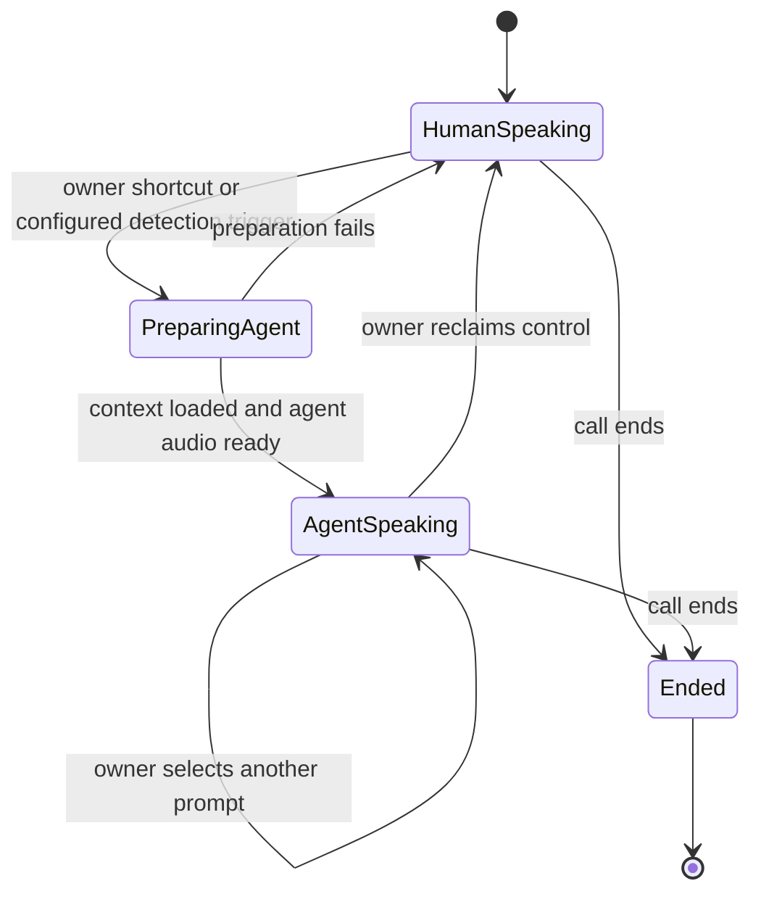

# Final build — put your AI on the call

**Call a business, press `#1`, and let an agent using a clone of your own voice continue the conversation. Press another shortcut to change its instructions, or take the conversation back.**

This is the modern version of putting someone on hold: instead of leaving them with elevator music while you step away, your AI representative stays in the conversation. It sounds like you, knows what has already been said, and works on the task you assigned.

**Status: product direction, not implemented.** The running Build 0 only speaks the team greeting. [Build 1](BUILD_1.md) remains the two-human switchboard milestone. This final-build direction extends the original inbound screening concept to user-controlled delegation on both inbound and outbound calls.

## Example: calling a car dealership

1. Start an outbound call to the dealership through the operator. Speak with the salesperson normally.
2. Explain which car you want and ask about its availability. The operator retains the conversation context needed for a handoff.
3. Press `#1`. An agent using your enrolled voice takes over that same dealership call, continuing from the current topic.
4. Press `#3` to change its task to collecting an itemized quote. The agent retains the conversation history while following the new instructions.
5. Rejoin when needed. The agent stops speaking, your microphone returns to the conversation, and you receive a summary of what happened while it represented you.

The other party remains on the existing call throughout. The owner can stay connected in a listening/control role while the agent speaks. Letting the owner hang up completely and later rejoin is an additional lifecycle feature, not an assumption of the first version.

## Keypad as a prompt selector

`#1`, `#2`, `#3`, and `#4` select saved instruction profiles for the agent. The exact assignments below are **proposed defaults**, configurable before a call; the required feature is switching between distinct prompts during the call.

| Shortcut | Proposed profile | Example instructions |
| --- | --- | --- |
| `#1` | Continue for me | Take over using the conversation so far and my current goal. |
| `#2` | Handle the wait | Stay on the line, respond when someone returns, and notify me when my attention is needed. |
| `#3` | Complete this enquiry | Ask the saved questions; for a dealership, collect availability and an itemized quote. |
| `#4` | My custom prompt | Switch to another owner-authored profile, such as comparing options or screening a suspicious caller. |

Reserve `#0` as the proposed **return control to me** command. Its exact binding is configurable too. The owner must always have a way to interrupt agent speech and reclaim the call.

Each shortcut supplies a trusted instruction update to the agent: it selects a prompt, updates the active goal, and routes the conversation to the configured agent/model if needed. The cloned voice can remain the same across all modes. This is the requested in-call prompt injection experience, implemented as owner-controlled instruction routing. Speech from the other party is conversation content; it cannot select a profile or overwrite the owner's instructions.

## Inbound and outbound entry points

| Direction | How the call reaches the operator | How takeover starts |
| --- | --- | --- |
| Inbound | An incoming call reaches the operator's Twilio number and is bridged to the owner. | Owner keypad command, or the separately configured AI-detection policy. |
| Outbound | The owner requests a destination through an authenticated operator flow; the operator connects the owner and destination in a managed call. | Owner keypad command at any point after the call is connected. |

A normal mobile call placed directly to the dealership does not automatically pass through this server. Outbound delegation requires the call to be routed through the operator from the start, for example through an app/callback flow or an access number. Choose that entry experience during implementation; both directions should then share the same handoff controller.

Manual takeover must work without first detecting an AI caller. The dealership can be a human, a phone menu, or another AI. Inbound AI detection remains an optional additional trigger for the same handoff flow.

## What transfers to the agent

On takeover or a mode change, build a versioned context packet from these fields:

| Field group | Contents |
| --- | --- |
| Call identity | Session ID, direction, owner leg, remote-party leg, and conference/bridge identity. |
| Voice and agent | Owner's authorized voice-profile ID, selected agent/model, and current prompt-profile version. |
| Conversation | Recent speaker-attributed turns, an accumulated summary, and the last unanswered question. |
| Task | Owner's goal, known facts, questions to ask, information already collected, and permitted actions. |
| Control | Current mode, who has the speaking role, handoff generation, and how to notify or return to the owner. |

Voice enrollment happens before the call, using the owner's own voice and a provider that supports the required cloning and streaming workflow. Store a voice-profile reference in the call session. Switching prompts should not require creating another clone.

The prompt describes the task and any boundaries the owner sets. For the dealership demo, the task is collecting information and reporting it back.

## Handoff behavior

Prepare the agent and confirm its audio path is ready before changing the owner's speaking role. While the agent speaks, keep the owner leg available for listening and controls. A return command cancels queued agent speech before restoring the owner's microphone, so both do not speak over each other.

Treat repeated command events safely: one command must not create several agent participants. A mode change updates one active session, preserving its context and voice. If the agent fails, restore the owner's ability to speak and signal that the takeover ended.

## Engineering work after the switchboard

1. **Outbound setup and ownership.** Add an authenticated call-start flow, destination handling, and explicit owner/remote/agent leg identities. Extend the inbound session model without assuming that the caller is always the remote party.
2. **Owner keypad controls.** Prove a transport that receives owner-leg DTMF while the remote conversation remains connected. Parse complete `#`-prefixed commands with a short timeout; handle ordinary phone-menu digits deliberately.
3. **Voice and agent bridge.** Select a voice-cloning provider and conversational runtime, enroll the owner voice, and prove two-way agent audio in the existing call. Validate latency, interruption, and voice consistency with real phone audio.
4. **Context and prompt routing.** Add transcription, summaries, saved prompt profiles, versioned updates, and handoff generation tracking. Map each configured shortcut to a profile and optional agent/model route.
5. **Return and resilience.** Add interruption, owner notification, call summaries, bounded agent duration, and failure recovery. Extend deployment handling so updating the server does not discard active call state.

The keypad/audio topology must be proven before promising these shortcuts. The current conference bridge plan does not yet establish a working mid-call DTMF receiver or a cloned-voice agent participant.

### Prototype the keypad route explicitly

Twilio's documented conference status events do not include DTMF callbacks. `<Gather>` cannot wrap `<Dial>`, and the verbs do not execute concurrently on a call leg. It also treats `#` as its default finish key, so a menu intended to collect a literal `#1` would need different settings. Sources: [Conference](https://www.twilio.com/docs/voice/twiml/conference), [Gather](https://www.twilio.com/docs/voice/twiml/gather), and [Dial](https://www.twilio.com/docs/voice/twiml/dial).

**Proposed prototype, not a confirmed implementation:** give the owner and remote party separate bidirectional Media Streams and bridge their audio in the application. Each stream exposes its leg's inbound audio; the owner's stream also supplies the owner's DTMF events. Initially relay human audio. At takeover, replace owner-to-remote audio with the voice agent's output while continuing to deliver remote audio to the owner and agent. Consume control sequences only from the authenticated owner leg. Test latency and command isolation before selecting this as the final topology.

Bidirectional streams accept audio and `clear` messages for queued playback, but `<Connect><Stream>` blocks subsequent TwiML; it does not simultaneously proceed into a conference on that same leg. Twilio supports inbound DTMF events for bidirectional streams, not unidirectional streams or outbound DTMF messages. Dealership phone-menu navigation therefore needs its own tested design. Sources: [Media Streams](https://www.twilio.com/docs/voice/media-streams) and [WebSocket messages](https://www.twilio.com/docs/voice/media-streams/websocket-messages).

This application audio bridge would be a deliberate evolution of the early conference implementation. Keep Build 1's two-human conference milestone, then compare this prototype with any alternative telephony control path before building the final keypad experience.

## Final-build acceptance

1. An owner starts an outbound dealership demo call through the operator, speaks first, and uses `#1` to hand off without disconnecting the dealership.
2. The agent uses the enrolled owner voice and correctly continues from facts already discussed; it does not restart the conversation from an empty prompt.
3. `#2`, `#3`, and `#4` select distinguishable saved prompts during the same call. Remote-party keypad input cannot activate owner controls, and incomplete or repeated commands do not create duplicate agents.
4. The owner can interrupt the agent and resume speaking. Agent failure also returns control cleanly; hangup ends the associated call legs and agent work.
5. The same delegation controls work on inbound calls. AI-detection-triggered takeover remains independently configurable, and a post-call summary separates what the human said from what the agent did.
