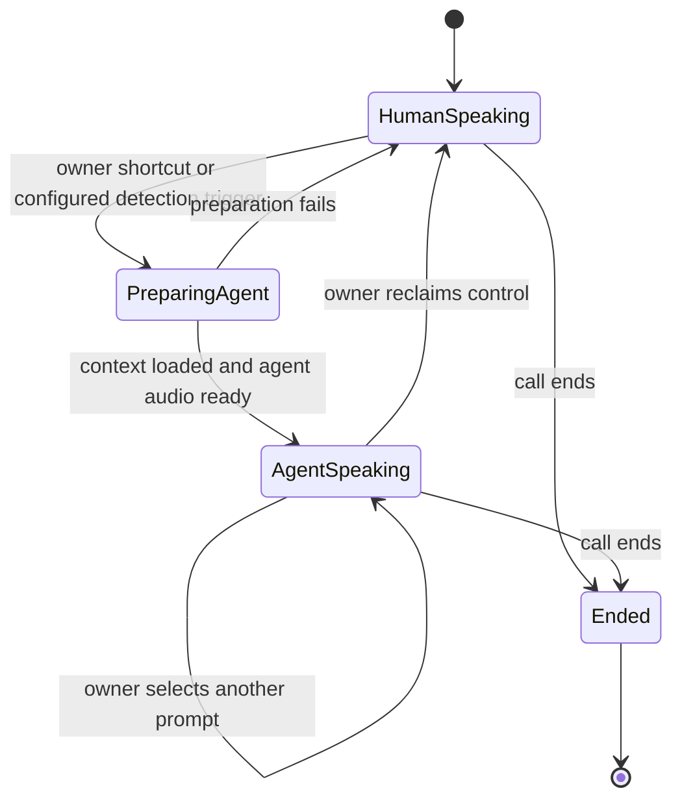

# Final build — put your AI on the call

**Call a business, press `#1`, and let an agent using a clone of your own voice continue the conversation. Press another shortcut to change its instructions, or take the conversation back.**

This is the modern version of putting someone on hold: instead of leaving them with elevator music while you step away, your AI representative stays in the conversation. It sounds like you, knows what has already been said, and works on the task you assigned.

**Status: specified for implementation.** The running [Build 1](BUILD_1.md) connects two humans in a conference. Build the final behavior with the selected [Python bridge recipe](IMPLEMENTATION.md) and [voice API adapters](VOICE_STACK.md). This extends the original inbound screening concept to user-controlled delegation on both inbound and outbound calls.

## Example: calling a car dealership

1. Start an outbound call to the dealership through the operator. Speak with the salesperson normally.
2. Explain which car you want and ask about its availability. The operator retains the conversation context needed for a handoff.
3. Press `#1`. An agent using your enrolled voice takes over that same dealership call, continuing from the current topic.
4. Press `#3` to change its task to collecting an itemized quote. The agent retains the conversation history while following the new instructions.
5. Rejoin when needed. The agent stops speaking, your microphone returns to the conversation, and you receive a summary of what happened while it represented you.

The other party remains on the existing call throughout. The owner can stay connected in a listening/control role while the agent speaks. Letting the owner hang up completely and later rejoin is an additional lifecycle feature, not an assumption of the first version.

## Keypad as a prompt selector

`#1`, `#2`, `#3`, and `#4` select saved instruction profiles for the agent. Implement the defaults below, configurable before a call; switching profiles preserves the conversation and voice.

| Shortcut | Default profile | Example instructions |
| --- | --- | --- |
| `#1` | Continue for me | Take over using the conversation so far and my current goal. |
| `#2` | Handle the wait | Stay on the line, respond when someone returns, and notify me when my attention is needed. |
| `#3` | Complete this enquiry | Ask the saved questions; for a dealership, collect availability and an itemized quote. |
| `#4` | My custom prompt | Switch to another owner-authored profile, such as comparing options or screening a suspicious caller. |

Reserve `#0` as **return control to me**. It always interrupts agent speech and restores the owner's microphone, including during provider failures.

Each shortcut supplies a trusted instruction update to the agent: it selects a prompt, updates the active goal, and routes the conversation to the configured agent/model if needed. The cloned voice can remain the same across all modes. This is the requested in-call prompt injection experience, implemented as owner-controlled instruction routing. Speech from the other party is conversation content; it cannot select a profile or overwrite the owner's instructions.

## Inbound and outbound entry points

| Direction | How the call reaches the operator | How takeover starts |
| --- | --- | --- |
| Inbound | An incoming call reaches the operator's Twilio number and is bridged to the owner. | Owner keypad command, or the separately configured AI-detection policy. |
| Outbound | The owner requests a destination through an authenticated operator flow; the operator connects the owner and destination in a managed call. | Owner keypad command at any point after the call is connected. |

Use the **owner-first callback** as the outbound entry experience: run the call script with the destination and goal, answer the operator's call, press `1` to accept, and let the server dial the dealership. This routes both phones through the Python bridge from the start. A normal mobile call placed directly to the dealership cannot be seized by this server later; the callback creates the managed call with the same ordinary handset experience. Both directions share one handoff controller.

Manual takeover must work without first detecting an AI caller. The dealership can be a human, a phone menu, or another AI. Inbound AI detection remains an optional additional trigger for the same handoff flow.

## What transfers to the agent

On takeover or a mode change, build a versioned context packet from these fields:

| Field group | Contents |
| --- | --- |
| Call identity | Session ID, direction, owner leg, remote-party leg, and conference/bridge identity. |
| Voice and agent | Owner's authorized voice-profile ID, selected agent/model, and current prompt-profile version. |
| Conversation | Recent speaker-attributed turns, an accumulated summary, and the last unanswered question. |
| Task | Owner's goal, known facts, questions to ask, information already collected, and permitted actions. |
| Control | Current mode, who has the speaking role, handoff generation, and how to notify or return to the owner. |

Voice enrollment happens before the call, using the owner's own voice and a provider that supports the required cloning and streaming workflow. Store a voice-profile reference in the call session. Switching prompts should not require creating another clone.

The prompt describes the task and any boundaries the owner sets. For the dealership demo, the task is collecting information and reporting it back.

## Handoff behavior

Prepare the agent and confirm its audio path is ready before changing the owner's speaking role. While the agent speaks, keep the owner leg available for listening and controls. A return command cancels queued agent speech before restoring the owner's microphone, so both do not speak over each other.

Treat repeated command events safely: one command must not create several agent participants. A mode change updates one active session, preserving its context and voice. If the agent fails, restore the owner's ability to speak and signal that the takeover ended.

## Selected implementation

Build the final call path as **two Twilio bidirectional Media Streams joined by a Python audio router**. The owner's incoming stream supplies audio and keypad commands. The remote stream supplies the other person's audio. In human mode, forward both directions. In agent mode, replace owner-to-remote audio with cloned speech while the owner hears a monitor mix and keeps keypad control.

Use **Deepgram Nova-3 → Claude Haiku 4.5 → ElevenLabs Flash v2.5** for the first working pipeline. Enroll the owner's voice before the call. Start with the provider adapters in [VOICE_STACK.md](VOICE_STACK.md), then attach them to the routing and cancellation controller.

1. Build the owner-first callback, authenticated stream binding, and human audio bridge.
2. Add `#1`–`#4` and `#0`, initially using fixed cloned clips to prove switching and interruption.
3. Attach transcription, attributed context, prompt selection, and streaming cloned replies.
4. Add real IVR navigation by temporarily replacing the remote call's TwiML with `<Play digits>` and a fresh stream. The remote Call SID remains the same; test and handle the reconnect gap.
5. Add owner notification, inbound entry, summaries, lifecycle recovery, and call-aware deployment.

[IMPLEMENTATION.md](IMPLEMENTATION.md) defines the modules, routes, Python/TwiML examples, audio frames and mixing, exact keypad parser, IVR workarounds, session races, and stage-by-stage phone tests. Platform limitations become explicit adapter work in that recipe; they are not reasons to leave the feature unspecified. Live validation remains necessary before marking a stage complete.

## Final-build acceptance

1. An owner starts an outbound dealership demo call through the operator, speaks first, and uses `#1` to hand off without disconnecting the dealership.
2. The agent uses the enrolled owner voice and correctly continues from facts already discussed; it does not restart the conversation from an empty prompt.
3. `#2`, `#3`, and `#4` select distinguishable saved prompts during the same call. Remote-party keypad input cannot activate owner controls, and incomplete or repeated commands do not create duplicate agents.
4. The owner can interrupt the agent and resume speaking. Agent failure also returns control cleanly; hangup ends the associated call legs and agent work.
5. The same delegation controls work on inbound calls. AI-detection-triggered takeover remains independently configurable, and a post-call summary separates what the human said from what the agent did.
