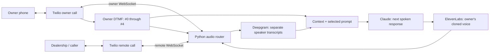

# Build the operator with a Python audio bridge

**Start by implementing two Twilio call legs connected through Python. Get two people talking through that bridge, then replace one direction with the cloned voice pipeline.**

This is the selected implementation recipe for the [final product](FINAL_BUILD.md). It describes code to add, not features already running. Build 1’s conference, ngrok, signed webhooks, and GitHub deployment already exist. Keep [Build 1](BUILD_1.md) as the small conference smoke test; its final-build successor uses the bridge below. Budget roughly 4–8 focused hours for the bridge/keypad prototype and another 8–16 for provider integration and failure tests, assuming working provider accounts and two test phones. These are engineering estimates, not measured build times.

## Use this architecture

Run one FastAPI/Uvicorn process with an in-memory session store and `asyncio` tasks. Twilio owns the phone calls; Python owns audio routing. Each phone has its own bidirectional `<Connect><Stream>` WebSocket. There is no conference on this final audio path. One stream per call provides the two independent inputs needed by the bridge. [Twilio Media Streams](https://www.twilio.com/docs/voice/media-streams).



**Human mode:** owner audio → remote, remote audio → owner; transcribe both directions separately. **Agent mode:** remote audio → owner and STT, agent audio → remote and owner; owner microphone audio is not forwarded or transcribed while delegated. The owner stays connected and uses the keypad. `#0` restores their microphone.

Use Deepgram Nova-3, Claude Haiku 4.5, and ElevenLabs Flash v2.5 with a previously enrolled owner voice. Copy the API adapters and settings from [VOICE_STACK.md](VOICE_STACK.md). This preserves one voice while profiles select different instructions or text models.

## Turn platform limits into implementation work

| Problem | Implementation to build |
| --- | --- |
| A direct carrier call never passes through this computer. | Start with a callback: Python calls the owner first, then the requested dealership. Both remain ordinary phone calls on the handsets. |
| Conference callbacks do not provide the required mid-call keypad receiver. | Use two independent bidirectional streams and route audio in Python. Read DTMF only from the owner's stream. |
| Media Streams has no outbound DTMF message. | Temporarily update the remote call to `<Play digits="…"/>`, followed by a fresh stream. Keep the same remote Call SID. |
| A voice provider returns a different audio format. | Request raw `ulaw_8000`; use the documented streaming FFmpeg conversion if the account requires PCM. |
| Prompt changes leave generated audio queued. | Increment a reply generation, cancel generation/TTS, discard old frames, and send Twilio `clear` before changing who speaks. |

These choices use documented primitives; the composed call flow still needs the live acceptance checks below. Conference/Gather sequencing explains the bridge choice: `<Gather>` is not a concurrent keypad listener around a `<Dial>` call. [Conference](https://www.twilio.com/docs/voice/twiml/conference), [Gather](https://www.twilio.com/docs/voice/twiml/gather).

## Add these modules

All paths in this table are **implementation targets**, except existing `app.py`, `config.py`, and `scripts/deploy.py`.

| Files | Responsibility |
| --- | --- |
| `operator_service/routes.py`, `sessions.py` | Authenticated call-start API, TwiML, role binding, call callbacks, session locks, deadlines and cleanup. Mount from `create_app` in `app.py`. |
| `operator_service/audio.py`, `codecs.py` | Two WebSocket readers, bounded queues, paced writers, owner monitor mix, interruption, generation checks. |
| `operator_service/controls.py`, `profiles.json` | Owner keypad parser, prompt selection, IVR digits, mode controller, owner notification. |
| `operator_service/stt.py`, `llm.py`, `tts.py` | Provider adapters from [VOICE_STACK.md](VOICE_STACK.md), ordered transcripts and reply pipeline. |
| `scripts/call.py`, `clone_voice.py`, `send_dtmf.py`; `tests/test_operator_*.py` | Local CLI wrappers, sample enrollment, deterministic fake-stream/provider tests. Extend `scripts/deploy.py` with call draining before activation. |

Use `operator_service`, not `operator`, to avoid shadowing Python's standard library. Pin Python 3.11 for this prototype if using its `audioop` codec/mixer. Before a newer-Python upgrade, replace that module or add a tested compatible dependency: `audioop` was removed in Python 3.13. [Python audioop lifecycle](https://docs.python.org/3/library/audioop.html).

Extend settings with `OWNER_NUMBER`, `ALLOWED_DESTINATIONS` (comma-separated E.164 numbers), `OPERATOR_ADMIN_TOKEN`, `MAX_CALL_SECONDS=1800`, and the provider variables in the voice guide. Use the existing `TWILIO_NUMBER` and REST credentials. Add secret-free examples to `.env.example`; put the actual server values in the installed service's `.env` described in [SERVER.md](SERVER.md).

For the first demo, accept outbound destinations only from this explicit local allowlist; reject the owner number and this service's Twilio number as destinations to prevent loops. Store per-session state in a dataclass: UUID, direction, goal, voice ID, profile, reply epoch, phase, created/deadline times, speaker-attributed turns, summary, and an `asyncio.Lock`. Each of the two legs stores its Call SID, Stream SID, transport generation, one-use stream token, socket, bounded audio buffers, pending playback marks, and terminal flag. Generate tokens with `secrets.token_urlsafe(32)`. **Reply epoch and transport generation are different counters.** Changing a prompt does not reconnect a phone call.

## Implement the control API

Keep the existing health and GitHub endpoints. Add these route families:

| Route | Contract |
| --- | --- |
| `POST /api/calls/outbound` | Bearer admin token; JSON `{"to":"<allowlisted E.164>","goal":"Ask for an itemized quote"}`; reserve a session and return `202` with its ID. The configured owner number cannot be overridden by this request. |
| `POST /voice` | Existing signed inbound webhook, extended to reserve the inbound Call SID as the remote leg, return stream TwiML, and arrange one owner callback. Duplicate requests reuse the same session. |
| `WS /media/{session_id}/{role}/` | Twilio-signed upgrade, then authenticated `start` binding. Roles are exactly `owner` or `remote`; reject a second socket for an already bound generation. |
| `POST /twilio/status/{session_id}/{role}` and `POST /twilio/reconnect/{session_id}/{role}` | Signed call-state receiver and instruction recovery endpoint. Every response and transition checks session/role/SID. Terminal sessions return `<Hangup/>` from recovery. |
| `GET /api/sessions/{id}`; `POST /api/sessions/{id}/mode`, `/dtmf`, `/end` | Bearer admin token. Return bounded status/transcript; select `human` or `1`–`4`; send validated remote IVR digits; or end both legs. Expose no credentials. |

`scripts/call.py` loads the environment locally, sends the authenticated request to `http://127.0.0.1:8000`, prints the session ID, and watches its status. Intended CLI after implementation:

```sh
.venv/bin/python scripts/call.py --to '<allowlisted E.164>' --goal 'Ask for an itemized out-the-door quote'
```

Add an `--env-file` option for use against the installed server. Make call-start idempotent using an `Idempotency-Key` UUID retained by the CLI for retries; one key maps to one session. Run blocking Twilio SDK operations with `asyncio.to_thread`, bounded client timeouts, and reserved state outside the network wait. Never dial on module import, health checks, or app startup: the deployment supervisor also starts candidate processes to test them.

## Dial the owner, then the destination

1. Reserve the owner leg and its random token before calling Twilio. Create the owner call using the configured `OWNER_NUMBER`, `TWILIO_NUMBER`, inline stream TwiML, a 25-second ringing timeout, and signed status callbacks. The first demo is one active session at a time.
2. Once the owner's validated stream starts, play a private cue: “Press 1 to connect.” In this preconnection state only, a bare `1` accepts. This prevents owner voicemail from automatically dialing the dealership. Allow 20 seconds, then end the session.
3. Reserve and create the remote call exactly once after acceptance. While it rings, play a local waiting cue only to the owner. Connect both audio directions when the remote stream starts; stop the cue first.
4. For inbound calls, bind the incoming caller as remote and call the owner. Play a short waiting cue to the caller until the owner accepts; after that, reuse the same bridge and controls. The incoming leg was not created by `create_leg`: update that Call SID with its session-specific `status_callback`, `status_callback_method="POST"`, and `time_limit` before relying on lifecycle cleanup. Do not replace its TwiML during this metadata update.
5. Give each phase its own deadline: owner ringing 25 seconds (allow Twilio's timeout buffer), owner acceptance 20 seconds, remote setup 45 seconds, plus a 90-second total setup ceiling. On busy, no-answer, or a deadline, end the incomplete session and any surviving leg. Treat SDK timeout as an uncertain outcome: reconcile the pending role from callbacks and Twilio call records; do not blindly make another call.

The call creation shape is supported by [Twilio's Calls API](https://www.twilio.com/docs/voice/api/call-resource). This helper is the target for `operator_service/routes.py`; `session`, `cfg`, and the reserved token come from the controller:

```python
from twilio.twiml.voice_response import VoiceResponse


def leg_twiml(public_base, session_id, role, generation, token, digits=None):
    response = VoiceResponse()
    if digits is not None:
        response.play(digits=digits)
    stream = response.connect().stream(
        url=public_base.replace("https://", "wss://", 1)
        + f"/media/{session_id}/{role}/"
    )
    stream.parameter(name="generation", value=str(generation))
    stream.parameter(name="token", value=token)
    response.redirect(
        public_base + f"/twilio/reconnect/{session_id}/{role}", method="POST"
    )
    return str(response)


def create_leg(client, cfg, session, role, destination, generation, token):
    return client.calls.create(
        to=destination,
        from_=cfg.twilio_number,
        twiml=leg_twiml(cfg.public_base_url, session.id, role, generation, token),
        timeout=25,
        time_limit=cfg.max_call_seconds,
        status_callback=cfg.public_base_url + f"/twilio/status/{session.id}/{role}",
        status_callback_method="POST",
        status_callback_event=["initiated", "ringing", "answered", "completed"],
    )
```

The random session path identifies the session/role; nested parameters carry the generation and token. Twilio stream URLs cannot contain query parameters. When `<Connect>` finishes, the trailing redirect gives the controller a recovery opportunity instead of exhausting the instructions. Limit recovery to two reconnects within ten seconds; afterwards end both legs with a visible error. [Stream TwiML](https://www.twilio.com/docs/voice/twiml/stream), [Connect lifecycle](https://www.twilio.com/docs/voice/twiml/connect).

### Authenticate and bind before routing audio

Reuse the official Twilio validator for HTTP callbacks with the configured public HTTPS origin and all received form fields. For WebSockets, validate `X-Twilio-Signature` before accepting, against the **fixed external stream URL**, never a localhost URL or request-supplied host. Begin with the exact `wss://…/` URL emitted above and empty GET form parameters. Twilio's security guide specifically mentions trailing-slash sensitivity for Voice WSS handshakes but does not explicitly resolve every framework's URL-scheme reconstruction. During the first owner-only call, retain a private handshake fixture and confirm the precise canonical URL against the SDK; if necessary correct that one canonicalization rule. Fail closed on mismatch, without accepting arbitrary host/scheme variants. [Twilio request validation](https://www.twilio.com/docs/usage/security).

Within five seconds of acceptance, require `start.accountSid` to match configuration, `start.callSid` to match the reserved leg, and the custom generation/token to match an unconsumed reservation. Check mono 8 kHz μ-law format. A signed start can arrive before `calls.create` returns: atomically bind its SID to the pending role, then require the eventual REST result to agree. Signed status callbacks may arrive first too; bind them only to the existing reserved session/role. Never create a new session from an unsolicited callback. Expire unused tokens after setup, rotate them on reconnect, and reject duplicate bindings.

## Route audio without building a delay queue

Use one reader per Twilio socket. Readers dispatch control messages immediately and put audio into bounded queues; they never wait on STT, Claude, or TTS. Use one writer per output socket to serialize media, marks, and clear messages. Give `clear` priority over audio.

Twilio exchanges base64 raw μ-law audio and identifies each output by its destination Stream SID. Normalize decoded payloads into 160-byte frames: 20 ms at 8 kHz. Frame size and pacing here are our design choices, not Twilio message-size requirements. Never forward the original source Stream SID or include WAV headers. [Twilio WebSocket messages](https://www.twilio.com/docs/voice/media-streams/websocket-messages).

```python
import base64


def media_message(destination_stream_sid: str, frame: bytes) -> dict:
    return {
        "event": "media",
        "streamSid": destination_stream_sid,
        "media": {"payload": base64.b64encode(frame).decode("ascii")},
    }
```

1. **Human relay:** forward each leg's incoming frames to the other output and to that leg's STT queue. Start with a two-frame jitter buffer. Cap live-audio buffers at ten frames (200 ms); on overflow discard the oldest audio and log a gap counter. Never accumulate seconds of stale human speech.
2. **Output clock:** emit one frame every 20 ms using monotonic deadlines. Do not burst a backlog after an event-loop stall. Use `0xff` μ-law silence for short underflows. Keep STT feeding independent; signal a transcript gap if its bounded queue overflows.
3. **Owner monitor:** in agent mode, mix remote audio and the same agent frames being sent to the remote. Decode both μ-law frames to signed 16-bit PCM, pad absent input with zero, apply half gain to each when both are present, saturating-add, and re-encode. Use `audioop.ulaw2lin`, `mul`, `add`, and `lin2ulaw` on Python 3.11. Do not concatenate two simultaneous streams and double playback duration. Human mode needs no mix.
4. **Agent output:** buffer at most 50 TTS frames (one second). Apply backpressure to the TTS producer; cancel a stuck utterance rather than dropping arbitrary middle words. A mode/reply change invalidates buffered frames by epoch before they reach either writer.
5. **Playback tracking:** mark the end of each spoken phrase. Track phrase ID, reply epoch, and whether it was cleared. A returned mark after `clear` does not prove the phrase was heard. Record interrupted phrases separately from confirmed completed phrases in conversation history.

For the hackathon, the owner monitor uses the local send clock, not guaranteed sample-accurate remote playback timing. Measure actual delay with two phones before shrinking buffers. Normal echo from a remote speakerphone can trigger STT; if it causes false barge-in, first test handsets/headsets, then add an echo-suppression stage against the known outgoing PCM reference.

## Make the keypad a deterministic controller

Twilio delivers DTMF on bidirectional streams for the inbound track. Only the bound owner leg may change modes. The remote party's keypad events cannot enter this parser. [Media Streams DTMF support](https://www.twilio.com/docs/voice/media-streams).

| Input while connected | Controller action |
| --- | --- |
| `#1`, `#2`, `#3`, `#4` | Select the matching saved prompt; keep the same voice and conversation history. |
| `#0` | Cancel agent work, clear playback, and restore owner-to-remote audio immediately. |
| `##` | Send one literal `#` to the remote IVR. |
| Bare `0`–`9` or `*` in human mode | Queue remote IVR digits. Coalesce digits until 300 ms idle, then make one call update. |
| Incomplete `#`, invalid suffix, or ordinary digits during agent mode | Consume locally; expire a prefix after two seconds. Agent IVR dialing uses an explicit controller action. |

Implement a two-state parser (`idle`, `after_hash`) using monotonic time. Reserve `#0` even when the agent fails. Deduplicate input using `(StreamSid, sequenceNumber)`, not digit/time alone: repeated identical digits can be intentional. An already-active profile is a no-op. A new profile cancels the previous reply and increments the epoch once. Key events from old transport generations are ignored.

Persist four default profiles in `profiles.json`: continue the owner's goal, wait and summon the owner, complete saved questions, and a custom owner-authored prompt. Each has `system_prompt`, optional `model`, and an action allowlist. Place trusted instructions in Claude's system field; put remote speech in conversation messages. Preserve owner and remote attribution when assembling the handoff, since both people were humans before delegation.

## Send real IVR digits on the existing remote call

Do not invent a WebSocket DTMF-send event or a `send_digits` option on call update. Use these Twilio primitives together: update the remote call's TwiML, play digits, then reconnect its stream. `<Play digits>` accepts `0–9`, `A–D`, `*`, `#`, `w` (half-second pause), and `W` (one-second pause). Cap requests at 32 characters and serialize them per session. [Play digits](https://www.twilio.com/docs/voice/twiml/play), [update a live call](https://www.twilio.com/docs/voice/api/call-resource#update-a-call).

```python
# After reserving the next remote transport generation and one-use token:
instructions = leg_twiml(
    cfg.public_base_url, session.id, "remote", next_generation, new_token,
    digits=validated_digits,
)
# Execute outside the asyncio event loop:
client.calls(session.remote.call_sid).update(twiml=instructions)
```

1. Mark the remote transport `RECONNECTING` under the session lock before the REST request. Pause agent output and owner-to-remote forwarding; keep the owner WebSocket alive with a private waiting cue.
2. The existing remote Stream SID closes while Twilio runs `<Play>`. The phone call retains its Call SID. A stream close is not a terminal call event.
3. Bind the next authenticated remote `start` to the new generation. Stop the cue and restore routing. Allow digit-duration plus a ten-second reconnect deadline. The trailing recovery route returns a fresh stream if the session is still active; recovery never repeats `<Play>`.
4. If the REST request times out, reconcile call/stream state before another operation. Do not automatically repeat digits: the first request may have succeeded. A failed reconnect ends the session with an owner-visible reason.
5. Prove this sequence against a test IVR before calling the dealership. Assert the remote Call SID is unchanged, the Stream SID changes, and both-way audio resumes. Audio during `<Play>` is temporarily outside the bridge; log that transcript gap. Use a test menu that waits for a choice, and measure whether a fast next prompt is missed.

If reconnect gaps make a specific IVR unusable, add **in-band tone generation** as the next workaround: synthesize standard dual-frequency DTMF into 8 kHz PCM, encode μ-law, and send it as ordinary remote audio. That path keeps the stream connected but depends on the destination recognizing audio tones; test that IVR rather than treating it as Twilio outbound DTMF signaling. If the IVR requires signaling and loses prompts on reconnect, keep the same controller and move the telephony adapter to a SIP/PBX bridge that can send RFC 4733 events while its media remains attached. The first implementation uses Twilio's native `<Play>` path.

## Take over, switch prompts, and return

1. **Prepare:** on `#1`–`#4`, snapshot goal, attributed conversation, pending question, voice ID, and profile. For human→agent takeover, keep human routing active while preparing the first phrase. For agent→agent profile changes, cancel the old reply and keep the owner muted during preparation. Invalidate/rebuild a prepared reply if newer dialogue makes its context stale. Use a three-second preparation deadline; if missed, return to human mode and signal failure privately.
2. **Activate:** when a complete first audio frame is ready, acquire the session lock, confirm the current epoch, switch to agent mode, and clear local owner-to-remote frames. The remote writer sends Twilio `clear` before its first agent frame, also removing human audio already buffered by Twilio. On the first takeover, say a short introduction such as “This is James's AI assistant; I'll continue the questions for him.” Use the enrolled voice; later profile switches continue naturally. Avoid inventing an answer to a question already answered by the owner.
3. **Converse:** keep remote STT running while the agent speaks. On remote speech-start, cancel the current reply, increment its epoch, clear agent audio on both outputs, and wait for a finalized remote turn. Switch profiles through the same cancellation path, preserving history. See the provider event handling in [VOICE_STACK.md](VOICE_STACK.md).
4. **Return:** `#0` cancels all agent producers, invalidates their epoch, removes local pending audio, sends `clear` to both Twilio outputs, and restores human routing. Returning does not depend on a successful provider request. Target under 250 ms from receipt of DTMF to local routing change; measure phone playback separately.
5. **Fail safely:** a provider error/timeout follows the return path and plays a private failure cue to the owner. Owner hangup ends the remote call in this version. Remote hangup cancels providers and ends the owner leg. A later detached-owner version must explicitly add rejoin/session persistence rather than accidentally leaving an agent alone.

For `#2`, the initial notification is a distinctive local earcon and private spoken cue in the owner's monitor, plus a status field visible to `scripts/call.py`. The owner remains connected. Implement an application-defined `notify_owner(reason)` action using Claude tool blocks; dispatch it locally, append its tool result, and continue the dialogue. The same controlled tool loop can expose `send_dtmf(digits)` when navigating menus. The basic text adapter in the voice guide must be extended to parse tool blocks before enabling these actions. No notification depends on a new SMS or email integration.

Build a context packet containing the last 20 finalized turns plus a rolling summary, owner goal, facts, and active profile. Refresh the summary asynchronously every ten finalized turns; summarization cannot block audio. Store agent text as intended speech first, then annotate phrase completion/interruption from playback state. Do not tell the model that a cleared response was fully heard. Keep raw audio out of Git and ordinary logs.

## Preserve calls during automatic deployment

Build 1 already implements authenticated `/internal/deploy` draining and waits for active sessions plus pending REST work. Preserve that protocol when replacing the conference with the audio bridge. The bridge must expose its own session/work counts through the existing endpoint; add the persistent journal in the last step:

1. Add an authenticated local drain endpoint and active-session count. Once draining, reject new outbound sessions with `503`; inbound `/voice` returns a short unavailable message. Existing sessions continue.
2. Prepare/test the new revision while the old revision handles calls. Candidate health checks must not dial, enroll voices, or connect STT providers without a session.
3. Immediately before activation, drain the old process and wait for zero active sessions. If calls remain after 60 seconds, cancel this activation, clear draining, and retry later. Do not terminate a call to apply an ordinary push.
4. Activate and health-check the candidate only after zero sessions. On failed activation, roll back using the existing supervisor path. Ensure every abort path clears the drain flag on the surviving process.
5. For crash recovery, persist session IDs and leg SIDs in a private SQLite journal outside per-release directories. On restart, reconcile recorded nonterminal calls with Twilio and end stranded legs. This prototype does not resume their conversation after a process crash.

Enforce a maximum session duration with both an application deadline and Twilio's per-call `time_limit` option at creation. Keep terminal session records long enough to absorb delayed callbacks, and never reopen them from an old event. Calls API settings are documented in [the call creation reference](https://www.twilio.com/docs/voice/api/call-resource#create-a-call).

## Build and verify in this order

Each stage produces one runnable demo. Tests use fake sockets/provider responses until the explicit phone check; credentials and destinations stay in local configuration.

1. **Bridge:** implement sessions, authenticated endpoints, owner acceptance, and paired audio. Test signature rejection, start-before-REST-result races, duplicate callbacks, hangup during dialing, orphan cleanup, and reconnect generations. Phone check: two humans speak both ways for 60 seconds without growing delay.
2. **Keypad and fixed clone:** enroll the owner's voice and cache one generated phrase privately. `#1` substitutes this clip; `#0` interrupts it. Other shortcuts select distinct fixed demo phrases. Test remote-key isolation, incomplete prefixes, repeated commands, and stale audio cancellation. This demonstrates takeover before adding an LLM.
3. **Conversational agent:** add the provider adapters, history, real prompt profiles, and owner monitor mix. Phone check: discuss a vehicle/model first, delegate, and verify the agent continues with those facts. Interrupt with speech and with `#0`; inject provider failures. Measure remote turn-end → first audible reply, aiming for under two seconds rather than claiming a provider inference number as phone latency.
4. **Menu and inbound:** build a separate test TwiML IVR with `<Gather>` on its own test call, exercise digits/reconnect, then test an allowlisted destination. Run the inbound caller → owner callback path with the same keypad controls. Confirm no remote key can change the owner's profile.
5. **Final operation:** add notification/tool handling, private summary output, session journal, and deploy draining. Push while a test call is active: the old revision must keep serving it; after hangup, the new revision should activate. Record actual phone-test results and remaining defects in the README.

The first concrete coding task is `operator_service/sessions.py` plus the owner-only callback and signed stream binding. Its exit criterion is one accepted phone call with a validated stream, before spending time on agent prompts.
