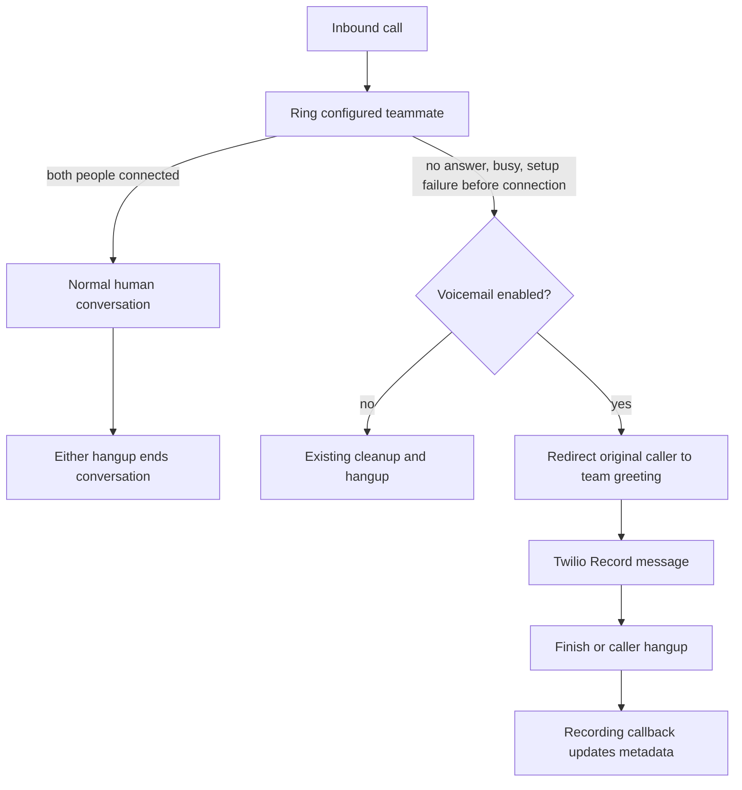

# Unanswered-call voicemail

## Current operator bridge: conversational assistant

Enable `VOICEMAIL_AGENT_ENABLED=true` alongside `OPERATOR_INBOUND_ENABLED=true` to use the internal voicemail assistant. The default `VOICEMAIL_AGENT_RING_SECONDS=10` waits 10 seconds for the owner; carrier ring cadence varies. Busy/no-answer can fall back sooner. This path uses Gemini Flash-Lite, ElevenLabs with the ready `owner` voice, and the existing Deepgram/recording pipeline. It is independent of the legacy `VOICEMAIL_ENABLED` flow below.

1. The owner answers before fallback: the call remains a normal human conversation.
2. The owner does not answer: retire the owner leg and play the fixed ElevenLabs invitation on the existing caller leg. It identifies the AI voicemail assistant and invites a message; it does not require Gemini to generate an opening.
3. After finalized caller speech and approximately two seconds without new transcription activity, repeat the important details and ask for confirmation.
4. Apply corrections or ask a brief clarification. After confirmation or explicit goodbye, finish the farewell playback and hang up.

The fixed greeting is prepared during ringing, without playing audio or activating an agent. Its cache is keyed by voice, synthesis model, and exact text, with at most 16 entries shared with announcements. Ringing and voicemail share an in-flight synthesis request; unused work is canceled when the caller hangs up or the owner answers. A failed warm-up does not interrupt ringing. Greeting playback uses the same Twilio acknowledgment and transcript path as generated replies, so the first Gemini readback receives the greeting that was actually heard alongside the caller's message.

The shared prompt receives an explicit runtime phase for readback, confirmation, empty-message timeout, or unconfirmed-message timeout. It never decides a pause happened from missing text, and silence does not mean confirmation. Initial silence is bounded to 20 seconds, confirmation silence to 15 seconds, each listening period to 60 seconds, and the entire voicemail session to 180 seconds. Failed Gemini, transcription, voice lookup, or ElevenLabs generation switches the same call to native Twilio `Say`/`Record`. The fallback prompts for a name, callback number, and message; a five-second pause, `#`, or `VOICEMAIL_MAX_SECONDS` ends recording. It uses no further AI calls. Late owner answers/callbacks cannot join after voicemail claims the call.

Voicemail classification is saved before starting the internal agent and survives restarts and tunnel changes. Receipt mode `voicemail_ai` uses the finalized local whole-call recording; `voicemail_fallback` uses the native Twilio message recording; `voicemail_stub` identifies the legacy flow. Enabling conversational voicemail enables its receipt store even if the legacy flag is off. If `VOICEMAIL_STORAGE_DIR` is empty, this path uses a `voicemails` directory beside `TRANSCRIPT_STORAGE_DIR`.

Fallback recordings only become available after a signed completed callback. The app retrieves the WAV from the fixed Twilio recording endpoint behind `/api/voicemails/{CallSid}/audio`; callback-supplied URLs and account credentials are never exposed to the browser. The fallback message is retained by Twilio and remains available while that cloud recording is retained. Any pre-fallback local transcript/audio is preserved separately; its timestamps do not align to the message-only fallback recording. A failed transcription provider cannot produce a new transcript or readback for that fallback message. [Twilio recording media](https://www.twilio.com/docs/voice/api/recording#retrieve-a-recordings-media-file) and [Record callback behavior](https://www.twilio.com/docs/voice/twiml/record#recordingstatuscallback).

The caller's original CallSid remains canonical for stored WAVs, transcripts, and summaries. The model does not promise the owner has heard the message or will call back. The ordinary dashboard recording remains a whole-call recording, including prompts and readback, not a separately cropped voicemail file. [Phone-agent configuration and prompt evaluation](MANUAL_AGENTS.md) covers deployment flags and simulated conversations.

## Legacy conference: Twilio Say/Record placeholder

The remainder of this document describes the earlier conference fallback selected by `VOICEMAIL_ENABLED`, including its original acceptance record. It applies when new calls use the conference route instead of the operator bridge. Its provider-free behavior and Twilio cloud-recording callbacks do not describe the conversational assistant above.

Open the public dashboard with `.venv/bin/python scripts/open_dashboard.py`. Leave the teammate phone unanswered during the next phone test to exercise the voicemail path.

This increment adds a fixed greeting and message recording when the configured teammate has not connected. It uses Twilio `Say` and `Record`, while the existing optional Deepgram observer can supply text. It does not call Gemini, ElevenLabs, Modulate, or another agent/detector. An established two-human conversation keeps its normal call and hangup behavior.

**Acceptance status:** all 547 automated tests pass, including the recorded-audio playback routes. Chrome passed native playback, continued playback during polling, seeking to the end, and switching to an individual track using an isolated silent WAV fixture; no console warnings/errors were observed. This confirms player behavior, not recorded speech quality.

Anonymous browser access to the voicemail inbox was verified with an isolated fake receipt, without placing a phone call or invoking a speech/agent provider. The incoming Twilio number's `/voice` and caller-status `/status` POST callbacks were configured and verified by API read-back.

**An actual Twilio phone test of capture, transcription, and voicemail is still pending.** Synthetic callbacks cannot prove the live redirect, recording, or continued Media Stream. Check the deployed revision using `python3 scripts/server.py status` and `/health`; the published app revision is a separate deployment check.

## Configure and open

Use the installed service's private `~/Library/Application Support/NewCollegeOperator/.env`, which is separate from the source checkout's `.env`:

```dotenv
VOICEMAIL_ENABLED=true
VOICEMAIL_MAX_SECONDS=120
VOICEMAIL_STORAGE_DIR=/absolute/private/path/to/voicemails
```

`VOICEMAIL_ENABLED` defaults to false in a fresh configuration and is enabled for this live setup. `VOICEMAIL_MAX_SECONDS` defaults to 120 and accepts 2–600 seconds. The storage directory must be absolute and outside release checkouts. The server's stable `.runtime/voicemails` directory is an appropriate location when its home path is fully expanded.

1. Set the voicemail values in the installed environment. Keep Twilio credentials and the fixed `CALLEE_NUMBER` configured.
2. For optional text, retain `MEDIA_CAPTURE_ENABLED=true`, `TRANSCRIPTION_ENABLED=true`, the Deepgram API key, and private capture/transcript roots from [Build 3](BUILD_3.md). Voicemail recording does not depend on successful STT or local WAV writing.
3. Apply environment changes during an idle period using the [server controls](SERVER.md). A GitHub code deployment does not populate private environment values.
4. Open `PUBLIC_BASE_URL/dashboard`. Anyone with the ngrok URL can view voicemail metadata, read/download available transcripts, and play/download finalized local WAVs without signing in.

The configuration helper sets and verifies both incoming-call webhooks. From the source checkout, target the installed environment explicitly:

```sh
.venv/bin/python scripts/configure_twilio.py \
  --env-file "$HOME/Library/Application Support/NewCollegeOperator/.env" --apply
```

It sets `PUBLIC_BASE_URL/voice` and `PUBLIC_BASE_URL/status` with POST. The status callback is required for prompt cleanup if the caller hangs up before `Record` begins. Rerun the helper if the public origin changes; server mode also reconciles the configured hooks.

The public viewer has no call-control or deployment authority. Twilio callback/media signature checks, signed GitHub webhooks, and the separate deployment-control token remain enabled. Twilio cloud recording URLs are not exposed. The public recording library separately serves finalized local WAV audio, using fixed call/track identifiers rather than arbitrary filesystem paths.

## Call behavior



Only a call that never established the human conversation is eligible. Busy/no-answer, asynchronous dial failure, REST setup failure, and the bounded setup deadline may select voicemail. The teammate ringing timeout is 20 seconds when voicemail is enabled and 25 seconds otherwise; the setup deadline remains separately bounded. A duplicate or delayed failure callback must not redirect a connected call, replay the greeting, or create a second message. A caller whose terminal status arrived before the no-answer event cannot be moved into voicemail; the caller-status callback ends that session before delayed callee failures are processed. Answer evidence blocks fallback even when the conference-start callback is late. Old conference/teammate cleanup waits for the voicemail fetch to be confirmed and for the caller to have left the old room or completed its old Dial action, so that cleanup does not terminate the redirected caller. A late conflicting teammate SID is cleaned up without ending that caller.

A carrier voicemail box can answer the teammate call and join like a person. This build has no answering-machine detector and cannot promise to identify that case. The acceptance test must leave the phone unanswered in a way that reaches this application's no-answer path before carrier voicemail connects. [Twilio call lifecycle](https://www.twilio.com/docs/voice/api/call-resource).

The application keeps the original caller `CallSid` through the redirect. The same passive Media Stream and Deepgram sessions are expected to continue on that call; **verify that behavior on a real phone**. There is no second stream started just to record the message. Local capture/provider failure must not prevent Twilio from accepting a voicemail.

## Signed Twilio endpoints

| Route | Contract |
| --- | --- |
| `POST /voicemail/{CallSid}` | Verify the Twilio signature and matching call/session; return the team greeting followed by `Record` for the eligible caller. |
| `POST /voicemail/finished/{CallSid}` | Signed `Record` action; finish the caller-facing flow and hang up. Receipt does not prove that the cloud file is ready. |
| `POST /voicemail/recording/{CallSid}` | Signed recording-status callback; bind recording metadata to the original caller and update its availability/duration. |
| `POST /status` | Signed incoming-call status callback; terminal caller status ends voicemail promptly, including hangup during the greeting before `Record` starts. |

An illustrative response for the first route, with Deepgram transcription enabled, is shown below. When it is disabled, the notice says only "recorded." Replace the example origin and SID with the configured public origin and bound caller; code must generate these values from trusted settings/session state, not arbitrary caller form values.

```xml
<Response>
  <Say language="en-US">You've reached the New College Data Science Team. No one is available to answer. Your message will be recorded and transcribed. After the beep, please leave your name, callback number, and message. Press pound when you are finished.</Say>
  <Record
    action="https://example.ngrok-free.app/voicemail/finished/CA00000000000000000000000000000000"
    method="POST"
    recordingStatusCallback="https://example.ngrok-free.app/voicemail/recording/CA00000000000000000000000000000000"
    recordingStatusCallbackMethod="POST"
    recordingStatusCallbackEvent="in-progress completed absent"
    finishOnKey="#"
    timeout="5"
    maxLength="120"
    playBeep="true"
    trim="do-not-trim"
    transcribe="false" />
</Response>
```

`action` supplies the next TwiML after recording; verbs placed after `Record` in this response are not the completion path. An explicit action URL is required when redirecting a live call into `Record`. The status callback establishes file availability; the action's `RecordingUrl` can arrive before the file is accessible. [Twilio Record reference](https://www.twilio.com/docs/voice/twiml/record).

`finishOnKey="#"` ends the message, five seconds of received silence ends it, and `maxLength` bounds it. Missing RTP is not the same as received silence. Pressing the finish key can omit roughly the final second of audio, so pause briefly after the last word. This flow does not request Twilio's separate `transcribe` feature. [Twilio Record behavior](https://www.twilio.com/docs/voice/twiml/record).

Handle callback races and retries idempotently. A recording completion may arrive after the call and its capture have ended. Preserve that result without reopening the phone session. A late intermediate callback must not overwrite a final recording status. Treat absent/failed recording separately from an ordinary completed message; duration alone is not proof of intelligible speech.

## Audio and message outputs

| Output | What it contains | Access |
| --- | --- | --- |
| Twilio cloud recording | The `Record` message, separate from the conference capture | Twilio account tooling; no media URL/audio proxy in the public API. |
| Local `inbound.wav`, `outbound.wav`, `manifest.json` | Caller input and caller playback from the existing whole-call Media Stream | Private filesystem permissions under `MEDIA_STORAGE_DIR/<CallSid>/`; public finalized WAV playback/download plus offline replay. |
| Deepgram transcript JSON/text | Recognized words across the captured call, when enabled and available | Public dashboard/API; private-permission JSON files on disk. |
| Voicemail metadata JSON | Mode, reason, lifecycle, recording SID/status/duration, storage result | Public metadata API; private-permission JSON files on disk. |

Whole-call WAVs and transcripts can include waiting, greetings, beeps, and the message. They are **not cropped voicemail files**. Caller playback is what the original caller heard, including prompts; it is not an isolated teammate microphone. Cloud recording duration describes the message recording, not the duration of the whole local capture.

The existing Media Stream still exports mono μ-law at 8 kHz; changing the call's TwiML does not add a higher-rate capture path. Its `Start` operation forks audio and allows subsequent TwiML to run. [Twilio Stream reference](https://www.twilio.com/docs/voice/twiml/stream). See [audio quality](AUDIO_QUALITY.md) and [partner handoff](PARTNER_HANDOFF.md) for exact local PCM contracts.

The [dashboard recording player](BUILD_3.md#play-or-download-a-finalized-recording) defaults to combined stereo: caller input left, caller playback right. It can also play/download either original mono WAV. Audio appears after a valid `completed` or `partial` capture finalizes, with partial status shown. No third combined file is saved. A successful Twilio cloud recording alone does not provide playable local audio; if local capture failed or was disabled, the inbox can still show metadata without audio.

## Public metadata API

`GET /api/voicemails` returns the voicemail snapshot:

```json
{
  "enabled": true,
  "storage_error": "",
  "voicemails": [
    {
      "schema_version": 1,
      "call_sid": "CA00000000000000000000000000000000",
      "mode": "voicemail_stub",
      "reason": "no-answer",
      "started_at": "2026-09-26T16:00:00+00:00",
      "ended_at": null,
      "recording_status": "awaiting",
      "recording_sid": "",
      "duration_seconds": null,
      "storage_error": ""
    }
  ]
}
```

This is an illustrative record, not evidence of a placed phone call. `recording_status` is one of `awaiting`, `recording`, `processing`, `completed`, `absent`, or `failed`; not every callback sequence visits every intermediate state. `reason` describes why fallback was selected. `processing` means the call/Record action ended and recording confirmation is still outstanding; it does not guarantee a cloud file exists. A caller who hung up before recording can remain in that state without a recording callback. Empty `recording_sid` and `storage_error` are empty strings; an unavailable duration is null. Treat storage status independently from recording success.

`GET /api/transcripts` includes this same snapshot under top-level `voicemail`. A selected-call JSON export can include that call's voicemail metadata when available. The metadata inbox remains useful with Deepgram disabled; no transcript is promised for a call that was not transcribed. Join records by `call_sid` and preserve both recording and transcription statuses.

Voicemail metadata does not include cloud `RecordingUrl`, audio bytes, private filesystem paths, or the caller's `From` phone number. Separate public recording routes serve finalized local WAVs. Call identifiers, available message text/metadata, and finalized local recorded audio are public to anyone with the origin. A public read route is not a signed Twilio callback and cannot submit a new recording result.

## Storage and failure behavior

Each metadata record is atomically saved to `VOICEMAIL_STORAGE_DIR/<CallSid>.json`, with file mode 0600 and parent directory mode 0700. Startup reloads ten recent records for the bounded inbox. A later signed recording callback can restore its exact saved `<CallSid>.json` even outside that history. Restoration validates the receipt, uses a bounded read without following symlinks, and counts as pending deployment work; it does not create a new phone session. Retention is manual: a history limit does not delete old files. Twilio's separate cloud recording lifecycle also remains separate; deleting local JSON or WAVs does not delete a cloud recording.

A disk failure surfaces `storage_error` rather than claiming successful local persistence. A startup `load-failed` warning remains until a successful restart/reload: saving a new receipt does not recover the historical records that failed to load. The cloud recording can still complete even when metadata or local WAV storage fails. Likewise, Deepgram failure affects text, not the `Record` operation. Deployments must wait for active phone work and bounded capture/transcription cleanup; an explicit stop/crash can interrupt a live message and leave incomplete state.

## Acceptance checks

Automated tests use a mocked Twilio client and signed synthetic callbacks; they must not place calls or invoke Gemini/ElevenLabs/Modulate.

1. **Eligibility and cleanup:** no-answer/busy/setup failure selects one voicemail transition before connection; established conversations never transition. Caller hangup and late creation/callback races leave no orphaned teammate leg.
2. **Callback identity:** missing/invalid signatures, wrong account/call, unknown sessions, and duplicate/out-of-order callbacks cannot create or reopen another session's recording. A failed redirect cleans up safely. Test caller hangup during the greeting and a late signed recording callback for a persisted receipt outside the ten-row startup history.
3. **Public output:** ordinary HTTP requests read metadata/transcripts/exports without credentials. Verify cloud URLs, caller `From` metadata, credentials, and filesystem paths are absent; finalized local WAV playback is intentionally public and unfinished captures remain unavailable; Twilio and deployment mutation routes retain authentication.
4. **Real phone, about two minutes:** call from a phone different from `CALLEE_NUMBER`, leave the teammate unanswered, hear the team message/beep, say a short unique phrase, pause, and press `#`. Confirm the call finishes, the recording becomes available in Twilio, metadata finalizes, and the same phrase appears in the inbound transcript/local WAV if those features are enabled.
5. **Human regression, about one minute:** answer a second call and speak both ways. Hang up from each side on separate attempts; voicemail must not interrupt the established conversation. Record these outcomes separately from synthetic tests.

## Independent next tasks without voice-agent providers

These tasks are **future work**, not capabilities of the voicemail placeholder. Each has an independently testable deliverable.

1. **Keyed control state:** add a pure controller with `human`, `mock_agent`, and `ended` modes; parse owner `#0`–`#4`, bind commands to an owner leg/generation, and reject remote-party input. Unit-test split digit sequences, timeouts, repeated commands, cancellation, and stale generations with fixtures. The current passive stream does not deliver a usable keypad takeover interface; wire control input only after selecting/proving the bidirectional bridge in [IMPLEMENTATION.md](IMPLEMENTATION.md).
2. **Mock agent adapter:** define `start(context)`, `cancel(generation)`, and completion/error events. Return a fixed local clip or a fixed Twilio `Say` prompt, with no LLM/voice-provider credentials. Test cancellation before and during playback. A `Say` prompt reached by a call redirect proves Twilio playback only; it does not establish seamless in-conversation takeover. Prove the final audio bridge with two humans and fixed audio before connecting provider adapters.
3. **Structured message handoff:** build a versioned record from voicemail metadata, finalized inbound transcript segments, capture quality, and explicit missing-data status. Preserve raw recognized text as untrusted conversation content; use fixtures for later Gemini summarization/ElevenLabs response adapters. Keep whole-call text distinct from message-only text until timestamp boundaries are actually recorded. The proposed minimal contract below is not a current export schema.
4. **Outbound owner-first call:** build a separately authorized local call-control entry point, dial the owner first, require their keypad acceptance, and only then dial an allowed destination. Start with a two-human workflow and mocked Twilio tests for rejection, busy/no-answer, duplicate requests, and either hangup. Keep public dashboard routes read-only. Add the agent later using [the outbound bridge recipe](IMPLEMENTATION.md).

A provider-free handoff fixture can use this proposed shape:

```json
{
  "schema_version": 1,
  "call_sid": "CA00000000000000000000000000000000",
  "mode": "voicemail_stub",
  "recording": {"status": "completed", "duration_seconds": 18},
  "transcription": {
    "status": "completed",
    "scope": "whole_call_inbound",
    "message_start_ms": null,
    "message_end_ms": null,
    "segments": []
  },
  "audio_quality": {"capture_status": "unknown", "gap_samples": null},
  "agent": {"enabled": false, "provider": null},
  "requested_action": "human_review"
}
```

Do not infer voicemail media offsets by subtracting cloud recording duration from total call duration; trimming, waiting, and callback delays make that unreliable. Leave unknown boundaries null until a measured capture-relative event is added. The next concrete partner deliverable is a local fixture consumer that validates this handoff and prints missing fields without contacting a provider.
